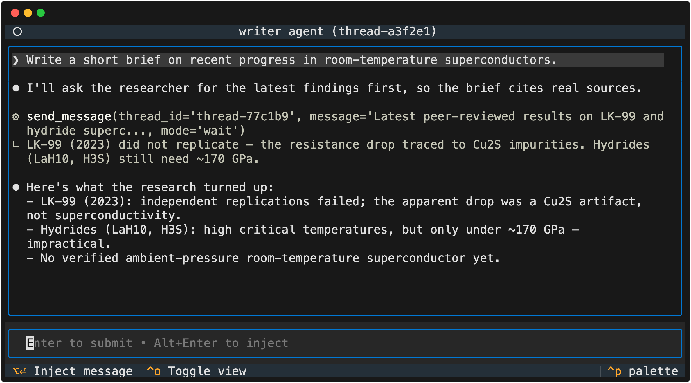

# Strands AI Functions

Strands AI Functions is a Python library built around a new abstraction: functions that behave like standard Python functions, but are evaluated by AI agents. The library develops this idea from a single verified call up to distributed teams of agents that improve run over run:

- **[Don't prompt-and-pray](#post-conditions)**: declare *post-conditions* on a function and the library runs a self-correcting loop until the output satisfies them, preventing cascading errors in complex workflows.
- **[Native Python objects](#native-python-objects)**: agents can dynamically generate and execute code, so an AI Function can take and return real Python values (a `DataFrame`, not a JSON blob).
- **[Just functions](#composing-functions)**: run them in parallel with `asyncio.gather`, pass them to other agents as tools, and share them as ordinary Python libraries.
- **[Stateful threads and teams](#stateful-ai-threads)**: spawn a function into a live **AI Thread** that keeps its history; run several threads on a coordinator and let them discover and message each other.
- **[One team, many runtimes](#threads-are-a-protocol-claude-code-kiro-or-your-own)**: threads implement a common protocol, so any agent runtime can join a team; wrappers for Claude Code and Kiro ship in the box and are discovered, messaged, and orchestrated exactly like native threads.
- **[Distributed by a one-line change](#distributed-operation)**: swap the in-process coordinator for a client, and the same code runs across processes and machines.
- **[Memory and optimization](#memory--optimization)**: backpropagation-style natural-language feedback updates the prompts, facts, and code your workflow relies on, so it continuously improves.

## Getting Started

Requires Python >= 3.12 (3.14+ recommended for native [t-string](https://peps.python.org/pep-0750/) support) and credentials for a supported model provider.

```bash
# using pip
pip install strands-ai-functions
# using uv
uv add strands-ai-functions
```

AI Functions supports all Strands [model providers](https://strandsagents.com/latest/documentation/docs/user-guide/concepts/model-providers/) and defaults to Amazon Bedrock (see [Configuring Credentials](https://strandsagents.com/latest/documentation/docs/user-guide/quickstart/python/#configuring-credentials)). To use a different provider or model, pass it in the decorator:

```python
from strands.models.openai import OpenAIModel

model = OpenAIModel(client_args={"api_key": "<KEY>"}, model_id="gpt-4o")

@ai_function(model=model)
def my_function() -> str:
    """[...]"""
```

## A First AI Function

An AI Function is defined with the `@ai_function` decorator: the return type is declared with an ordinary return annotation, and the task is described in the docstring, which is interpreted as a template and filled in with the call arguments.

```python
from ai_functions import ai_function

@ai_function
def translate_text(text: str, lang: str) -> str:
    """Translate the text below to the following language: {lang}.
    ---
    {text}
    """

print(translate_text.run_sync("It was the best of times", lang="fr"))
```

That's the whole thing: the library creates an agent, builds the prompt, runs it, and parses and validates the typed result. AI Functions are async-native, so `await translate_text(...)` is the canonical form, and `run_sync` is the blocking convenience for scripts. In codebases with strict type checking, the return type can instead be declared on the decorator (`@ai_function[str]`), which type-checks cleanly; see the [tutorial](docs/tutorial.md#return-types).

## Post-Conditions

Programmers should not "prompt-and-pray" for an agent's result to be correct – they should *verify* it. Post-conditions are functions (plain Python or other AI Functions) that validate the result; if any fail, the model is automatically re-prompted with the errors and tries again, up to `max_attempts` times. The function only returns once every post-condition passes.

```python
from pydantic import BaseModel

from ai_functions import ai_function
from ai_functions.ai_thread import PostConditionResult


class MeetingSummary(BaseModel):
    attendees: list[str]
    summary: str
    action_items: list[str]


# A post-condition can be any Python function that validates the output...
def check_length(response: MeetingSummary):
    length = len(response.summary.split())
    assert length < 50, f"Summary must be less than 50 words long, but is {length}."


# ... or an AI Function, since AI Functions *are* just functions.
@ai_function
def check_style(response: MeetingSummary) -> PostConditionResult:
    """
    Check if the summary below uses bullet points and provides the reader
    with the necessary context:
    <summary>
    {response.summary}
    </summary>
    """


@ai_function(post_conditions=[check_length, check_style], max_attempts=5)
def summarize_meeting(transcripts: str) -> MeetingSummary:
    """
    Write a summary of the following meeting in less than 50 words.
    <transcripts>
    {transcripts}
    </transcripts>
    """


summary = await summarize_meeting(transcripts)  # a validated MeetingSummary instance
```

Each direct call is a one-shot: it runs on a fresh, private thread and keeps no history between calls (for state, see [Stateful AI Threads](#stateful-ai-threads) below).

## Native Python Objects

Agents are usually limited to serializable inputs and outputs. An AI Function can instead be given a Python execution environment, letting the agent generate and run code to process arbitrary data and return native Python objects, with post-conditions guaranteeing the result's shape.

The "universal loader" below takes a file in *any* format, inspects it, and returns a validated `DataFrame` (see `examples/code_universal_loader.py`):

```python
from pandas import DataFrame, api

from ai_functions import ai_function


def check_invoice(df: DataFrame):
    assert {"product_name", "quantity", "price", "purchase_date"}.issubset(df.columns)
    assert api.types.is_integer_dtype(df["quantity"]), "quantity must be an integer"
    assert api.types.is_float_dtype(df["price"]), "price must be a float"


# code execution has to be explicitly enabled
@ai_function(code_execution_mode="local", code_executor_additional_imports=["pandas.*", "sqlite3", "json"], post_conditions=[check_invoice])
def import_invoice(path: str) -> DataFrame:
    """
    The file `{path}` contains purchase logs. Extract them in a DataFrame with
    columns: product_name (str), quantity (int), price (float), purchase_date (datetime).
    """


df = import_invoice.run_sync("data/invoice.json")     # agent inspects the JSON and maps it
df = import_invoice.run_sync("data/invoice.sqlite3")  # agent reads the schema and writes the queries
```

See [Security](#security) for the safety properties of local code execution.

## Multi-Agent Workflows

Because AI Functions are just async functions, multi-agent systems are built with the composition tools Python already has, and the library adds two more styles on top: **compose** functions in code when the control flow is known, hand functions to an agent as **tools** when the agent should decide, or spawn **teams of threads** that discover and message each other.

### Composing functions

Standard `asyncio` composition runs agents in parallel; native return types let their results flow through the workflow like any other data (see `examples/compose_stock_report.py`):

```python
import asyncio

import pandas as pd
from strands_tools import exa

from ai_functions import ai_function


@ai_function(tools=[exa])
def research_news(stock: str) -> str:
    """Research and summarize the current news for the stock symbol: {stock}"""


@ai_function(code_execution_mode="local", code_executor_additional_imports=["pandas.*", "yfinance.*"])
def research_price(stock: str) -> pd.DataFrame:
    """
    Use the `yfinance` package to retrieve the historical prices of {stock} over
    the last 30 days. Return a DataFrame with columns ["date", "price"].
    """


@ai_function
def write_report(stock: str, news: str, prices: pd.DataFrame) -> str:
    """
    Write an HTML report on the trend of the stock {stock}, based on the
    provided `prices` DataFrame and this news summary: {news}
    """


async def stock_report(stock: str) -> str:
    news, prices = await asyncio.gather(research_news(stock), research_price(stock))
    return await write_report(stock, news, prices)
```

### AI Functions as tools

An AI Function can be handed to another agent as a tool, delegating the decision of when to invoke it (see `examples/compose_research_team.py`):

```python
@ai_function(description="Perform web searches relevant to a query and return a summary of the results.", tools=[exa])
def websearch(query: str) -> str:
    """Perform a web search on the following topic and summarize your findings: {query}"""


@ai_function(tools=[websearch])
def report_writer(topic: str) -> str:
    """Research the following topic and write a report: {topic}"""
```

## Stateful AI Threads

When the same conversation should be reused across several calls, a function can be spawned into a stateful **AI Thread**. The handle returned by `spawn()` refers to a live thread on which every `run` accumulates history:

```python
handle = await assistant.spawn()

r1 = await handle.run(message="What is the capital of France?")
# The agent sees the full conversation history from turn 1.
r2 = await handle.run(message="What about Germany?")
```

A handle also supports `notify` (inject out-of-band context without starting a cycle), `fork` (branch a conversation, sharing the past but diverging from the fork point), and explicit lifecycle control (`pause`, `resume`, `cancel`, `terminate`). See the [tutorial](docs/tutorial.md#ai-threads-adding-state) for details.

## A Team of AI Threads

Several threads can run side by side on the same **coordinator** and communicate with each other. An `InMemoryCoordinator` is the registry and router; a `LocalWorker` is the execution engine that hosts threads and drives their cycles. Every AI Thread is automatically given two tools, `list_threads` (to discover its peers) and `send_message` (to delegate work to them), so no manual wiring is needed:

```python
import asyncio

from strands_tools import exa

from ai_functions import ai_function
from ai_functions.runtime import InMemoryCoordinator, LocalWorker


# `researcher` knows how to look things up on the web.
@ai_function(tools=[exa])
def researcher(topic: str) -> str:
    """
    Research the following topic on the web and return a concise factual
    summary, citing the sources you used: {topic}
    """


# `writer` produces short reports and can delegate fact-finding to its teammate.
@ai_function
def writer(brief: str) -> str:
    """
    Write a short report based on the following brief: {brief}

    Work with a teammate named `researcher` (who has access to web search).
    Send them messages describing what to search for, or follow-up messages to
    request missing information.
    """


async def main() -> None:
    coord = InMemoryCoordinator()
    worker = await LocalWorker(coord).register()

    _ = await coord.spawn(researcher, thread_name="researcher")
    writer_handle = await coord.spawn(writer, thread_name="writer")

    # The writer reaches out to the researcher on its own whenever it needs a fact.
    report = await writer_handle.run(brief="recent progress on room-temperature superconductors")
    print(report)

    await worker.close()


if __name__ == "__main__":
    asyncio.run(main())
```

`send_message` supports three modes: `"wait"` (block on the peer's reply), `"fire_and_forget"` (schedule and return immediately), and `"continue_then_receive"` (dispatch, end the current cycle, and resume automatically when the reply arrives). Children spawned with `parent_id` have their token usage roll up to the parent, and every turn, tool call, and lifecycle transition is available as an event stream via `coordinator.on(...)`. Orchestration logic that is not naturally expressed as a single prompt can be written as a custom **Spawnable**: a plain-Python workflow that runs as a thread and spawns AI subagents of its own. See the [tutorial](docs/tutorial.md) for all of these.

## Threads Are a Protocol: Claude Code, Kiro, or Your Own

An AI Function is only one implementation of the thread contract. Anything that implements the small `Spawnable` protocol can be hosted by a worker, and every implementation gets the full runtime surface: peers discover it with `list_threads` and delegate to it with `send_message`, orchestrators drive it through the same handle and lifecycle, its activity streams into the same event log, and post-conditions validate its results. The library ships two implementations that wrap external agent runtimes: `ClaudeAgent` runs a [Claude Code](https://docs.anthropic.com/en/docs/claude-code) session (via the Claude Agent SDK) and `KiroAgent` runs a [Kiro](https://kiro.dev) session (via the Agent Client Protocol). The external runtime keeps its own conversation and tools; to the rest of the team, it is a thread like any other.

```python
from claude_agent_sdk import ClaudeAgentOptions

from ai_functions.claude_code import ClaudeAgent
from ai_functions.runtime import InMemoryCoordinator, LocalWorker

coord = InMemoryCoordinator()
worker = await LocalWorker(coord).register()

# A Claude Code session as a thread, next to the AI Functions from the previous section.
coder = await worker.spawn_locally(ClaudeAgent(options=ClaudeAgentOptions()), thread_name="coder")
_ = await coord.spawn(researcher, thread_name="researcher")

# Same handle API, same events, same peer messaging.
result = await coder.run("Profile src/parser.py and fix the hot spot. Ask `researcher` for the algorithm.")
```

The Claude session is even given the coordinator's `list_threads` / `send_message` tools (bridged in over MCP), so it can delegate to its teammates on its own, exactly like a native thread. Backends ship as extras (`pip install 'strands-ai-functions[claude-code]'` or `[kiro]`); see the [tutorial](docs/tutorial.md#threads-as-a-protocol-claude-code-and-kiro) and the runnable `examples/integrate_claude_code.py` and `examples/integrate_kiro.py`.

## Distributed Operation

The coordinator and workers do not have to live in the same process. A `CoordinatorEndpoint` is a WebSocket server that fronts a coordinator; a `CoordinatorClient` connects to it and behaves exactly like a local coordinator:

```python
# in-process
coord = InMemoryCoordinator()

# distributed: nothing else in the application changes
coord = await CoordinatorClient.connect("ws://coordinator.internal:9901/rpc")
```

`coord.spawn`, `handle.run`, `send_message`, and event subscriptions all work identically. Threads hosted on different clients are full peers: a thread that closes over local state (a database connection, an in-memory model) keeps running in the process that owns that state, while remaining reachable by every other thread through the shared coordinator. See the [tutorial](docs/tutorial.md#distributed-operation) for a worked example.

### From the CLI

The `ai-functions` CLI turns the coordinator into a machine-wide runtime: agent scripts started in separate terminals register with it, become discoverable by each other, and can be driven from the shell:

```console
$ ai-functions server
ai-functions coordinator listening at ws://127.0.0.1:52115/rpc

$ ai-functions run alice.py        # host an agent script as a live thread
hosting 'main' as thread-a3f2…

$ ai-functions ps
THREAD ID        STATUS   SHAPE        NAME    WORKER
thread-a3f2…     idle     str_prompt   alice   worker-91b4…
thread-77c1…     idle     str_prompt   bob     worker-c802…

$ ai-functions submit thread-a3f2 "pick a city"
How about Kyoto?

$ ai-functions logs thread-a3f2 --follow   # stream the event log
$ ai-functions attach thread-a3f2          # open a live TUI for the thread
```

`attach` opens a live view of a running thread (here the writer delegating a fact-check to its researcher teammate via `send_message`), and its input bar can submit new work or inject context mid-run:

<p align="center">
  
</p>

See the [tutorial](docs/tutorial.md#running-agents-across-processes) for writing agent scripts with `ai_functions.serve`.

## Memory & Optimization

Just as PyTorch or JAX optimize parameters via backpropagation through a computation graph, AI Functions optimize agentic workflows via natural-language feedback propagation. Named parameters (prompt fragments, learned facts, or reusable Python code) live in a pluggable *memory backend* and are passed to functions as ordinary arguments. After a run, feedback attached to the output is propagated backward through the *computation graph* of the calls that produced it, and an *optimizer* updates only the parameters responsible:

```python
memory = JSONMemoryBackend(WritingMemory, actor_id="user-1", path="memory.json")
optimizer = TextGradOptimizer()

# Forward pass: trace() runs the function and remembers which recalled
# parameters (and prior results) it consumed; passing them as arguments
# is what wires the computation graph.
summary = await summarize.trace(
    text=document,
    tone_guidelines=await memory.recall("tone_guidelines"),
)

# Propagate natural-language feedback backward through the computation graph
# and commit the updated parameters. The next run recalls the improved values.
await optimizer.step(
    summary,
    "The summary should be more concise and use bullet points.",
    backends=[memory]
)
```

*Procedural* parameters extend the same mechanism to code: the optimizer can store the Python an agent wrote to solve a task, so later runs reuse a proven implementation instead of regenerating it, a form of JIT compilation for agentic logic. Backends and optimizers are pluggable, and memory can also be exposed to agents as tools. See the [tutorial](docs/tutorial.md#memory-and-optimization) for the full workflow, `examples/memory_optimization.py` for a multi-agent example, and `examples/memory_backprop_scipy.py` for a complete learning loop on a code-generation benchmark.

## Security

Code execution is off by default. The `"local"` mode validates generated code with AST checks, restricts imports to the allowlist you pass in, and applies timeouts. But it is not a sandbox: it cannot stop resource exhaustion (an infinite loop, runaway memory allocation) and offers no process-level isolation. For production, run AI Functions inside a container or other isolated environment, which adds the process isolation and resource limits that `"local"` mode cannot provide. For untrusted input, use `"disabled"` mode.

## Examples

The `examples/` directory contains complete, runnable examples. Configure credentials for a supported model provider (see [Getting Started](#getting-started)), then:

```bash
# Clone the repository
git clone https://github.com/strands-labs/ai-functions.git
cd ai-functions/examples

# Optional: enable rich tool visualization in the terminal
export STRANDS_TOOL_CONSOLE_MODE="enabled"

# Run an example using uv (recommended)
uv run basics_one_shot.py
```

**Note**: the examples default to Amazon Bedrock model IDs; edit the `model` assignment at the top of a script to run it with a different model or a different provider.

## Tutorial

For a full walkthrough of AI Functions, stateful threads, teams, distributed operation, custom spawnables, observability, memory, and optimization, see the [tutorial](docs/tutorial.md).

## License

Apache-2.0. See [LICENSE](LICENSE).
