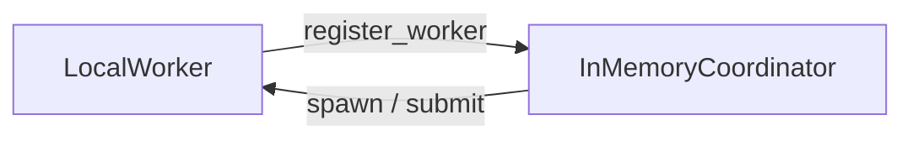
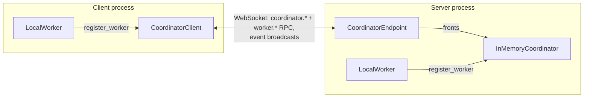
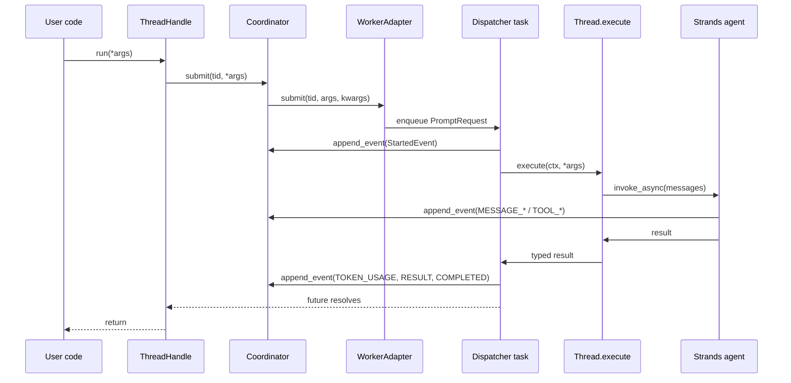
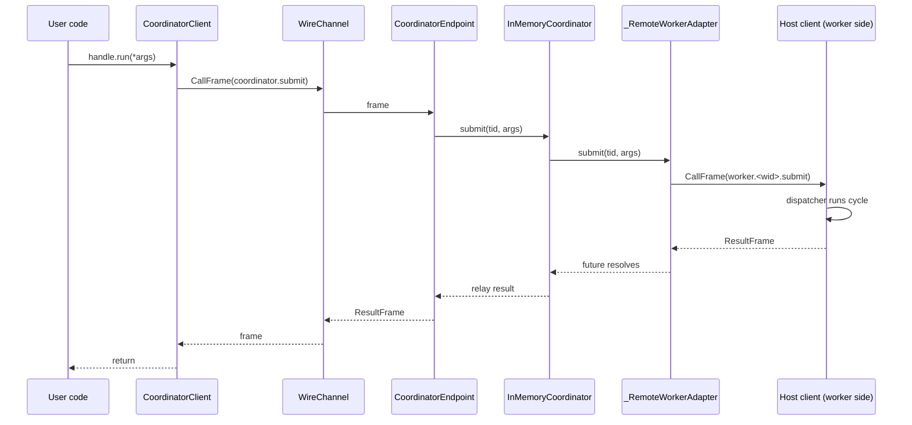
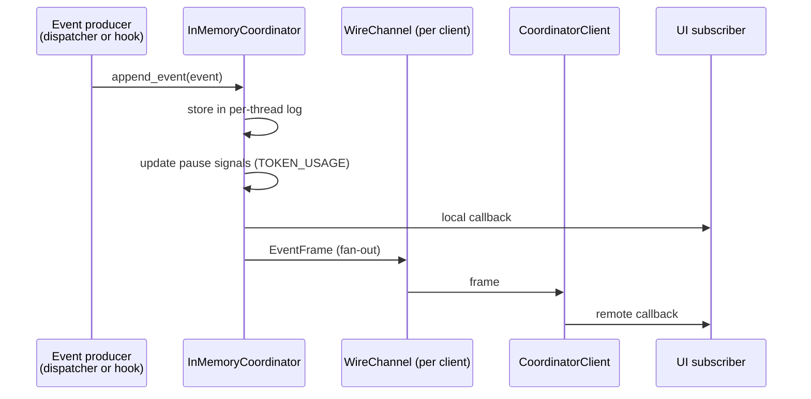

# Architecture

This document describes the internals of Strands AI Functions: the protocols every thread implements, how to write custom thread types, how the coordinator and workers cooperate, how the runtime spans processes, and end-to-end traces of the main data flows. It is aimed at contributors and at advanced users who want to extend the library or understand its behavior precisely.

It assumes familiarity with the user-facing concepts — AI Functions, AI Threads, coordinators, workers, and events — introduced in the [tutorial](tutorial.md). No new user-facing APIs are introduced here; every name below is either defined in the tutorial or documented in the API reference.

## Contents

- [Object model at a glance](#object-model-at-a-glance)
- [The thread contract](#the-thread-contract)
- [Custom spawnables](#custom-spawnables)
- [The runtime](#the-runtime)
- [Networking](#networking)
- [Under the hood: four traced flows](#under-the-hood)

## Object model at a glance

The library is built from a small set of objects with sharply separated responsibilities:

| Object | Role |
| --- | --- |
| `Spawnable` | A *factory* for a thread. Its only required method is `to_thread()`, returning a live `Thread`. |
| `Thread` | The live, runnable instance a worker drives: one `execute` per cycle, plus lifecycle and serialization hooks. |
| `AIFunction` / `AIThread` | The built-in implementation of both protocols: a prompt-templated, LLM-backed thread with post-conditions. |
| `Coordinator` | The authoritative broker: registry of threads and workers, durable per-thread event logs, router for every cross-thread operation. `InMemoryCoordinator` is the in-process implementation; `CoordinatorClient` implements the same interface over a WebSocket. |
| `Worker` | The execution engine that hosts threads and drives their cycles. `LocalWorker` runs an asyncio dispatcher task per thread, in its own process. |
| `ThreadHandle` | A thin reference held by user code: a `thread_id` plus the coordinator that owns it. All operations (`run`, `notify`, `fork`, lifecycle) delegate to the coordinator. |
| `Event` | The unit of observability and history. Every turn, tool call, lifecycle transition, and result is an event, durably stored in the coordinator's log. |

Two structural rules follow from this separation and are worth internalizing before reading further:

1. **The coordinator and the worker only ever see the two protocols.** Nothing in the runtime is specific to LLM-backed threads; an `AIThread` and a plain-Python workflow thread are indistinguishable to the machinery that hosts and routes them.
2. **The event log is the source of truth for history.** An `AIThread` does not hold its conversation in memory between cycles; it reconstructs the message history from the coordinator's event log at the start of every cycle. This is what makes forking, late-attaching UIs, replay, and the memory optimizer's `build_graph` possible with no additional bookkeeping.

## The thread contract

Every thread in the library implements two protocols:

- **`Spawnable[**P, T]`** — a factory for a thread:
  - `to_thread()` returns a live `Thread` instance.
  - `input_shape` (property) declares the shape of the thread's entry point, used for peer discovery — e.g. whether the thread accepts a single `str` prompt (and can therefore be targeted by `send_message`) or structured arguments.
- **`Thread[**P, T]`** — the live, runnable instance the worker drives:
  - `name` — a human-readable name for telemetry.
  - `execute(ctx, *args, **kwargs)` — run one cycle and return the typed result. `ctx` is a `ThreadContext` carrying the thread id and a reference to the coordinator, built fresh for every cycle.
  - `notify(text)` — receive an out-of-band text payload. The contract is deliberately weak: "here is some context"; the thread decides whether, when, and how to surface it, and may ignore it entirely.
  - `fork()` — return a new thread seeded with a copy of this thread's state. Threads whose only state is the event log can support this essentially for free; threads that own external state (a subprocess, a remote session) are free to raise `NotImplementedError`.
  - `teardown()` — release resources on termination.
  - `serialize_result(result)` / `deserialize_result(payload)` — convert the typed result to and from a string payload, so results can be stored in the event log and cross process boundaries.

`AIFunction` is the built-in `Spawnable`, and `AIThread` the corresponding `Thread`. When an `AIFunction` is called directly (`await fn(...)`), the library creates a private coordinator and worker, runs one cycle on a fresh thread, and tears everything down before returning — which is why direct calls are one-shots with no history.

## Custom spawnables

Any class that satisfies the two protocols can be hosted by a worker — there is nothing special about AI-backed threads. Writing a custom spawnable is the way to define orchestration logic that is not well expressed as a single prompt, or that needs access to unserialized local state (a database connection, a file handle, an in-memory model).

### Orchestration in plain Python

The following example defines a report-writing workflow as a custom spawnable. The workflow itself runs no LLM; it uses `ctx.coordinator` to spawn AI children for the steps that do:

```python
import asyncio
from typing import Self

from pydantic import BaseModel

from ai_functions import ai_function
from ai_functions.types import ThreadContext


class AnalysisReport(BaseModel):
    topic: str
    sections: list[str]
    word_count: int


@ai_function[list[str]]
def outline_generator(topic: str):
    """Generate 3 section titles for a report about: {topic}"""


@ai_function[str]
def section_writer(title: str, topic: str):
    """Write a short section titled '{title}' for a report about: {topic}"""


class ReportWorkflow:
    """Plain Python orchestration — no LLM in this layer.

    The outline generation and the section writing use AI. The coordinator
    manages everything as threads with proper parent-child relationships and
    token rollup.
    """

    name: str = "report_workflow"

    def to_thread(self) -> Self:
        # Already a live thread instance; the worker calls this at spawn.
        return self

    @property
    def input_shape(self):
        from ai_functions.types import InputShape
        return InputShape.STRUCTURED

    async def execute(self, ctx: ThreadContext, topic: str) -> AnalysisReport:
        outline_handle = await ctx.coordinator.spawn(
            outline_generator, parent_id=ctx.thread_id, thread_name="outline",
        )
        sections = await outline_handle.run(topic=topic)
        await outline_handle.terminate_now()

        writer_handles = [
            await ctx.coordinator.spawn(
                section_writer, parent_id=ctx.thread_id, thread_name=f"writer-{i}",
            )
            for i in range(len(sections))
        ]
        written = await asyncio.gather(*[
            h.run(title=title, topic=topic)
            for h, title in zip(writer_handles, sections, strict=True)
        ])
        await asyncio.gather(*[h.terminate_now() for h in writer_handles])

        full_text = "\n\n".join(written)
        return AnalysisReport(
            topic=topic, sections=sections, word_count=len(full_text.split()),
        )

    async def notify(self, text: str) -> None:
        del text  # workflow ignores injections

    async def fork(self):
        raise NotImplementedError

    async def teardown(self) -> None:
        pass

    def serialize_result(self, result: AnalysisReport) -> str:
        return result.model_dump_json()

    def deserialize_result(self, payload: str) -> AnalysisReport:
        return AnalysisReport.model_validate_json(payload)
```

The `ReportWorkflow` is itself a `Spawnable` (it implements `to_thread`) and a `Thread` (it implements the runtime surface). Spawning it produces a thread whose `execute` uses the coordinator to spawn AI children, gather their results, and return a typed value. Because the workflow is an ordinary thread, it gets everything threads get: a handle, lifecycle control, an event log, reachability as a peer, and — thanks to `parent_id` — token usage from the children rolling up to the workflow's own thread.

Custom thread implementations are also expected to translate their own activity into the shared event vocabulary (see [Events and observability](tutorial.md#events-and-observability)), so that logs, UIs, and metrics work uniformly across thread types.

## The runtime

### The coordinator

An `InMemoryCoordinator` owns three pieces of state:

- the **registry** of threads and workers, including a routing table mapping each `thread_id` to the adapter of its hosting worker;
- the **event log**, one durable, append-only sequence of events per thread;
- the set of live **subscribers** registered via `on(...)`.

Every cross-thread operation flows through it. `submit(thread_id, *args, **kwargs)` looks up the hosting worker in the routing table and enqueues a `PromptRequest` on that worker's per-thread work queue, returning an `asyncio.Future` that resolves when the cycle completes. `append_event(event)` follows a canonical path: the event is first durably stored in the per-thread log, then fanned out to every matching subscriber. Subscribers are invoked synchronously one after another; a failure in one callback is logged and swallowed so the rest still receive the event. If the event's `kind` is `TOKEN_USAGE`, the coordinator also updates its per-thread pause signals so that rate-limited threads stop consuming work until the window refreshes.

### Workers and the dispatcher

A `LocalWorker` hosts threads in its own process. For each hosted thread it runs a **dispatcher task**: an asyncio coroutine started at spawn that awaits work from the thread's FIFO queue, builds a fresh `ThreadContext` per cycle, emits a `StartedEvent`, calls `thread.execute(ctx, *args, **kwargs)`, and, on completion, emits a `ResultEvent` carrying the serialized result followed by a `CompletedEvent`, resolving the `PromptRequest`'s future with the typed value.

The single dispatcher per thread is what gives `run` its FIFO semantics: multiple concurrent `run` calls on the same handle each enqueue one `PromptRequest` behind any already pending, and the dispatcher consumes them one at a time.

For an `AIThread`, `execute` renders the prompt (either from the docstring template or from the body's return value), appends it to an inject buffer, and calls the internal `_run_cycle(ctx)`. `_run_cycle` reconstructs the message history from the event log (`reconstruct_messages(await ctx.coordinator.get_events(ctx.thread_id))`), builds a Strands agent with the resolved cycle config, and invokes it. An event-bridge hook installed on the agent drains the inject buffer at the first model-call boundary — emitting one `MESSAGE_USER` event per entry, which is also how `notify` payloads surface — and emits assistant turns, tool calls, and tool results as the agent produces them. After the cycle completes, `_run_cycle` extracts the typed result, emits a `TOKEN_USAGE` event, runs all post-conditions in parallel, and either returns the result or feeds the failure messages back as additional `MESSAGE_USER` events and retries, up to `max_attempts` times.

### Spawning across the wire

When a target is spawned through a `CoordinatorClient`, the target and its arguments are sent to the receiving worker. That worker may not share the caller's code base, so the library uses `cloudpickle` rather than plain `pickle`: `cloudpickle` ships the closure itself instead of assuming the target class is importable by name on the other side. The receiving worker needs a compatible Python runtime, but not an identical package layout.

Some targets cannot or should not be serialized — for example a spawnable holding local resources such as an open database connection. For these, `LocalWorker.spawn_locally(target, ...)` passes the target by reference and never serializes it. The thread is hosted on that worker, and its handle is backed by whatever coordinator the worker is registered with (`InMemoryCoordinator`, `CoordinatorClient`, or any other implementation of the protocol). This is the path `AIFunction.__call__` and `AIFunction.spawn()` take internally, so a direct call never pickles the spawnable.

## Networking

Two objects extend the runtime across processes:

- **`CoordinatorEndpoint`** is a WebSocket server that fronts an ordinary `Coordinator` (typically an `InMemoryCoordinator`). It exposes every coordinator method as an inbound RPC and broadcasts events to all connected clients.
- **`CoordinatorClient`** connects to an endpoint and implements the `Coordinator` interface by forwarding each call over the socket. Code that holds one uses it exactly the way it would use an `InMemoryCoordinator`.

The connection is **symmetric**: a `LocalWorker` registered on the client side hosts its threads in the client's process, and the endpoint can still route `spawn` and `submit` requests to it. When a client registers a worker, the endpoint stores a `_RemoteWorkerAdapter` shim for it — an adapter that turns coordinator-side calls into outbound `worker.<wid>.*` RPCs back to that client. A thread hosted on a client and a thread hosted on the server are therefore full peers, and either can message the other.

A worker always runs in the same process as the threads it hosts. This is a requirement for some threads, not just a convenience: a thread may close over a database connection, a file handle, or an in-memory model that only exists on the caller's machine, and cannot be moved to another process. The client-side worker lets such a thread run where its resources are while remaining reachable through the shared coordinator; cross-thread operations do not depend on where a peer is hosted, because the coordinator routes to the hosting worker in both cases.

**In-process deployment**



**Distributed deployment**



## Under the hood

This section traces four representative data flows — a local `run`, a remote `run`, a `send_message` between workers, and an event fan-out — end to end.

### `await handle.run(...)` — local case

A `ThreadHandle` holds a `thread_id` and a reference to the coordinator that owns it. `handle.run(*args, **kwargs)` delegates to `coordinator.submit(thread_id, *args, **kwargs)`, which looks up the hosting worker in its routing table and enqueues a `PromptRequest` on that worker's per-thread work queue. The call returns an `asyncio.Future` immediately; the cycle runs later on the worker's dispatcher task.

The dispatcher awaits work from the queue, builds a fresh `ThreadContext`, emits a `StartedEvent`, and calls `thread.execute(ctx, *args, **kwargs)`, which for an `AIThread` proceeds through `_run_cycle` as described in [Workers and the dispatcher](#workers-and-the-dispatcher). Control then returns to the dispatcher, which emits a `ResultEvent` carrying the serialized result followed by a `CompletedEvent`, and resolves the `PromptRequest`'s future with the typed value. The user's `await handle.run(...)` completes.



### `await handle.run(...)` — remote case

The API is identical to the local case; the path differs at the coordinator boundary. The handle's coordinator is a `CoordinatorClient` rather than an `InMemoryCoordinator`. `submit` cloudpickles `(args, kwargs)` into a `CallFrame` and sends it over the `WireChannel` to the `CoordinatorEndpoint` on the other side.

On the endpoint, the frame is dispatched to the inner `InMemoryCoordinator`'s `submit`. The inner coordinator looks up the hosting worker: if the thread is hosted by a `LocalWorker` on the server side, the call enqueues a `PromptRequest` locally exactly as in the local case. If the thread is hosted by a worker that lives on a *different* connected client, the adapter stored for it is the `_RemoteWorkerAdapter` shim built when that client registered its worker; the shim turns the `submit` call into an outbound `worker.<wid>.submit` RPC on its own `WireChannel` back to that client. The client-side worker's dispatcher runs the cycle; events produced during the cycle are appended to the client's coordinator (a `CoordinatorClient`), which translates each `append_event` into an outbound RPC to the endpoint, where the inner coordinator durably stores them and broadcasts them to every connected channel.

When the cycle completes, the worker resolves the `PromptRequest`'s future; the shim turns the resolution into a `ResultFrame` back to the endpoint. The endpoint relays the result to the originating client as a `ResultFrame`; `CoordinatorClient.submit`'s awaitable resolves with the decoded value. The user's `await handle.run(...)` completes, with no visible difference from the local case.



### `send_message` between two threads on different workers

When an `AIThread` cycle invokes `send_message(peer_id, "...", mode="wait")`, the tool closure reaches `ctx.coordinator` (captured at cycle start) and calls `ctx.coordinator.submit(peer_id, message)`. The coordinator looks up the peer's hosting worker in its routing table and enqueues a `PromptRequest` on that worker's queue. The tool awaits the returned future.

If the peer lives on the same worker as the sender, the call never leaves the process. If the peer lives on a different worker — whether local, on a `LocalWorker` registered with the same coordinator, or remote, on a `CoordinatorClient`-fronted worker — the coordinator routes to the peer's adapter, which may be a local `LocalWorker` or a `_RemoteWorkerAdapter` shim. Either way, the peer's dispatcher runs the cycle, resolves the future, and the tool receives the typed result.

The three modes differ only on the sender's side. For `mode="wait"`, the sender's cycle remains blocked on the future. For `mode="fire_and_forget"`, the tool discards the future and returns immediately. For `mode="continue_then_receive"`, the tool schedules a callback on the future that issues a fresh `coordinator.submit(sender_id, peer_reply)` when the peer completes, queuing a follow-up cycle on the sender.

### An event reaches a UI subscriber

An `append_event(event)` call goes through the coordinator's canonical path described in [The coordinator](#the-coordinator): durable storage first, then synchronous fan-out to matching subscribers, with `TOKEN_USAGE` events additionally updating the per-thread rate-limit pause signals.

When the coordinator is an endpoint's inner coordinator, the fan-out additionally serializes each event as an `EventFrame` on every connected `WireChannel`. On the client side, the `CoordinatorClient` receives the `EventFrame` and dispatches it to its own local subscribers. The net effect is that any code that called `coord.on(callback)` receives matching events, regardless of whether the event was produced in the same process, by a worker on another client, or by a server-side `LocalWorker`.


