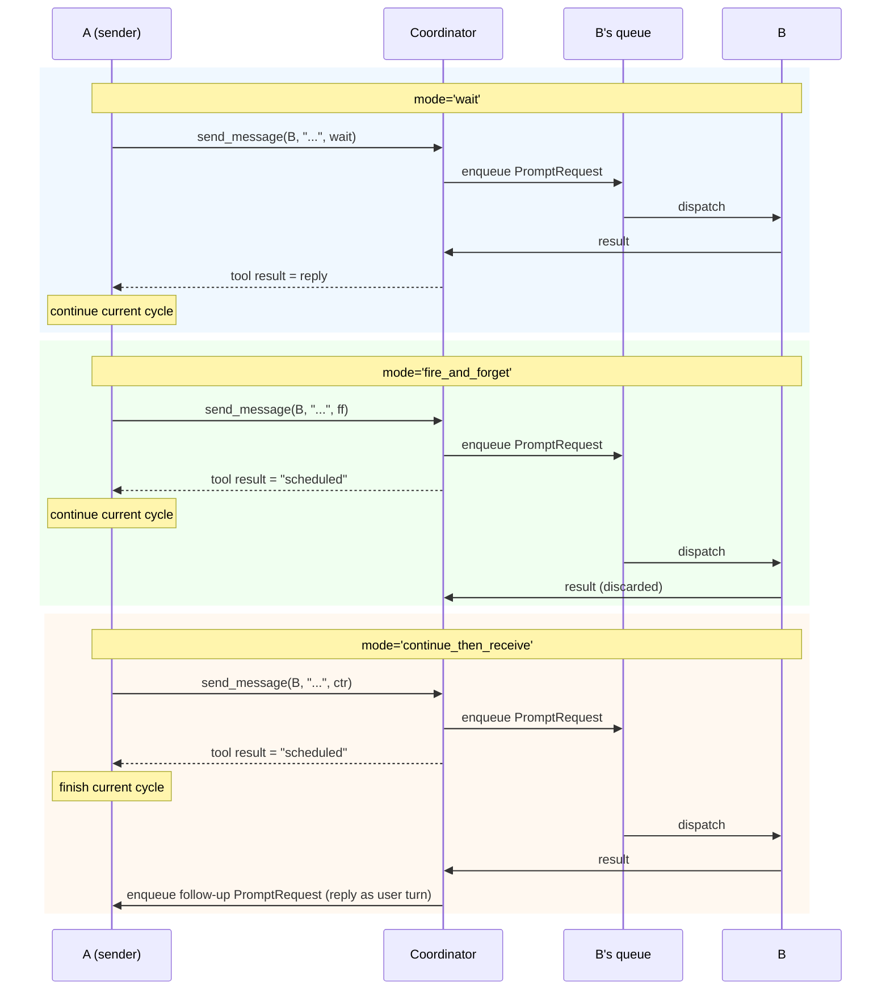
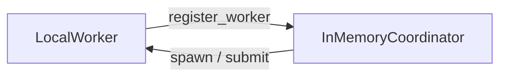
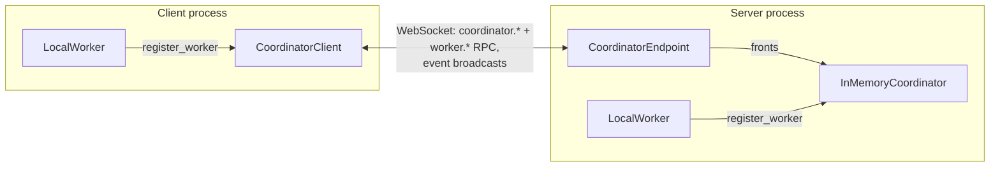
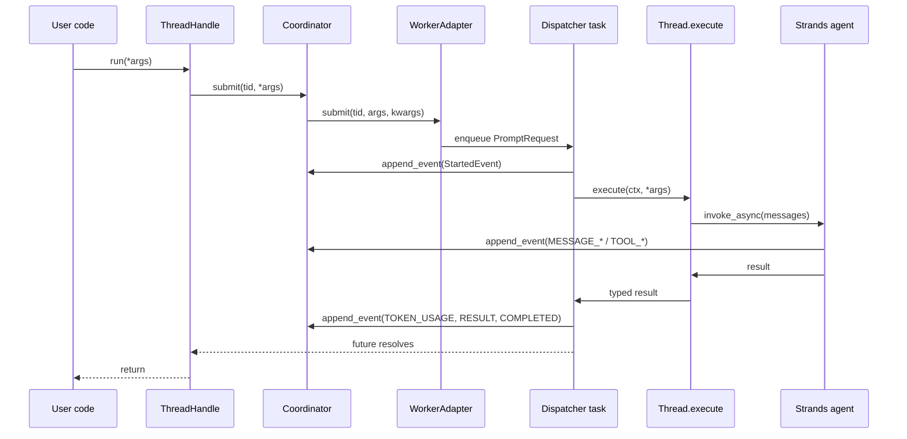
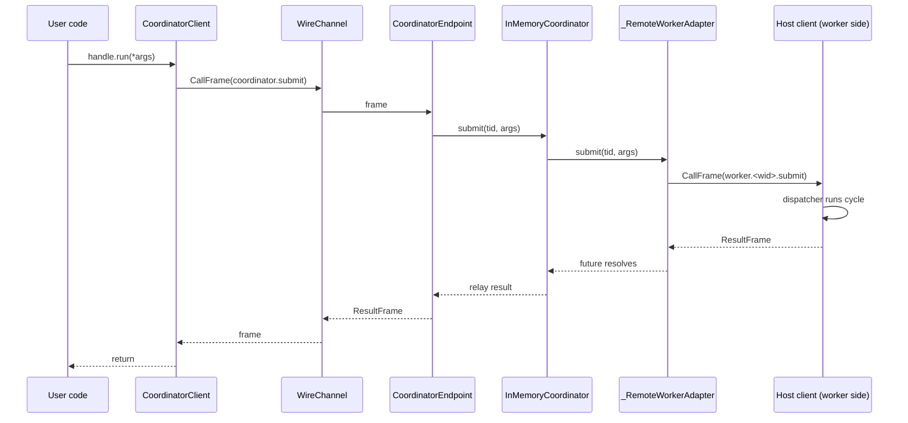
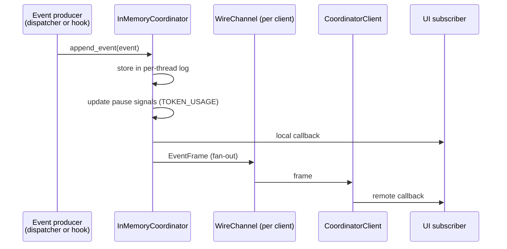

# AI Functions Tutorial

> ⚠️ **v2 — work in progress.** This tutorial documents v2 of AI Functions.
> The branch is unstable and has no PyPI release.
> For the published version, see
> [strands-labs/ai-functions](https://github.com/strands-labs/ai-functions)
> or `pip install strands-ai-functions`.

## Getting Started

The minimum supported Python version is 3.13.
We recommend using `uv` (see [installation instructions](https://docs.astral.sh/uv/getting-started/installation/)) to run the provided examples.

To install AI Functions from source on this branch:
```bash
# using pip
pip install "git+https://github.com/strands-labs/ai-functions.git@wip/v2"
# using uv
uv add "git+https://github.com/strands-labs/ai-functions.git@wip/v2"
```

This repo provides several examples. To run the examples, first configure the credentials for one of the supported model providers (see [Configuring Credentials](https://strandsagents.com/latest/documentation/docs/user-guide/quickstart/python/#configuring-credentials)).
Then, clone the repo and run the examples using `uv` from within their folder:
```bash
# clone the repo
git clone -b wip/v2 https://github.com/strands-labs/ai-functions.git
cd ai-functions/examples
# run the examples using uv
# (change the model settings inside the example if not using Bedrock as the model provider)
uv run [name_of_the_example].py
```

AI Functions uses the same default model provider as Strands (Amazon Bedrock). You can change the model provider used in the examples by changing the `model` argument (see [Model Providers](https://strandsagents.com/latest/documentation/docs/user-guide/concepts/model-providers/)):
```python
from ai_functions import ai_function
from strands.models.bedrock import BedrockModel
from strands.models.openai import OpenAIModel

# Use Bedrock
model = BedrockModel(
    model_id="anthropic.claude-sonnet-4-20250514-v1:0"
)
# Alternatively, use OpenAI by just switching model provider
model = OpenAIModel(
    client_args={"api_key": "<KEY>"},
    model_id="gpt-4o"
)

@ai_function(str, model=model)
def my_function() -> None:
    """[...]"""
```

## Quick Start

Before we go through everything in detail, let's look at two short examples that together give a sense of what the library is for. The first shows what a single robust AI call looks like. The second shows two AI Threads collaborating as a small team. Everything that follows is variations and scale on these two patterns.

### An AI function with post-conditions

An `AIFunction` behaves like a standard function, but its code is written in natural language rather than Python, and it is executed by an LLM rather than a CPU. To define one, we use the `@ai_function` decorator, specify its output type, and describe what the function should do inside its docstring (we'll cover alternative methods later).

```python
import asyncio

from pydantic import BaseModel

from ai_functions import ai_function
from ai_functions.ai_thread import PostConditionResult


# We start by defining the structured output type for our meeting-summarization
# function. An AI function can return any data type: primitive (str, int, ...),
# json-serializable (pydantic models), or general Python objects (numpy arrays,
# dataframes, ...). The library takes care of the necessary conversions and
# validation under the hood.
class MeetingSummary(BaseModel):
    attendees: list[str]
    summary: str
    action_items: list[str]


# Post-conditions can be any Python function validating the output...
def check_length(response: MeetingSummary) -> None:
    """Post-condition: summary must be less than 50 words."""
    length = len(response.summary.split())
    assert length < 50, f"Summary must be less than 50 words long, but is {length}."


# ... or they can be AI functions, since AI functions *are* just functions.
@ai_function(PostConditionResult)
def check_style(response: MeetingSummary):
    """
    Check if the summary below satisfies the following criteria:
    - It must use bullet points
    - It must provide the reader with the necessary context

    <summary>
    {response.summary}
    </summary>
    """


# Finally we define the main AI function, specifying the desired behavior both
# through the prompt (generated automatically from the docstring using the
# provided arguments) and the provided post-conditions. The library will ensure
# the result passes all the requirements before returning it.
@ai_function(MeetingSummary, post_conditions=[check_length, check_style], max_attempts=5)
def summarize_meeting(transcripts: str):
    """
    Write a summary of the following meeting in less than 50 words.
    <transcripts>
    {transcripts}
    </transcripts>
    """


# `summarize_meeting` can now be called just like any other async function.
async def main() -> None:
    transcripts = "..."
    # `meeting_summary` will be an instance of `MeetingSummary`.
    meeting_summary = await summarize_meeting(transcripts)
    print(meeting_summary)


if __name__ == "__main__":
    asyncio.run(main())
```

AI Functions are stateless by design: each call runs on a fresh thread and no history is kept between them. Some use cases need more — a chatbot accumulating turns, a team of agents that talk to each other, a long-running coordinator that fans out work. These call for AI Threads: live, stateful objects that stay alive across several calls and can interact with each other.

### A stateful conversation

The simplest way to keep state across calls is to spawn a single thread from an AI Function and reuse it. The handle returned by `spawn()` refers to a live thread on which every `run` accumulates history:

```python
import asyncio

from ai_functions import ai_function


@ai_function(str)
def assistant(message: str):
    """{message}"""


async def main() -> None:
    handle = await assistant.spawn()

    r1 = await handle.run(message="What is the capital of France?")
    print(f"Turn 1: {r1}")

    # The agent sees the full conversation history from turn 1.
    r2 = await handle.run(message="What about Germany?")
    print(f"Turn 2: {r2}")


if __name__ == "__main__":
    asyncio.run(main())
```

The function itself is unchanged from an ordinary AI Function; what is different is that the handle keeps its event log between calls, so the agent sees the full conversation on each subsequent `run`.

### A team of AI Threads

Several threads can also run side by side on the same coordinator and talk to each other. In the example below, we build a small two-agent team: a `researcher` thread specialized in looking up information, and a `writer` thread whose job is to produce short reports and that can delegate fact-finding to the researcher.

```python
import asyncio

from ai_functions import ai_function
from ai_functions.runtime import InMemoryCoordinator, LocalWorker
from strands_tools import exa


# `researcher` knows how to look things up on the web.
@ai_function(str, tools=[exa])
def researcher(topic: str):
    """
    Research the following topic on the web and return a concise factual
    summary, citing the sources you used:

    {topic}
    """


# `writer` is a short-form writer. The system prompt tells it about its
# teammate; the `send_message` tool is injected automatically by the
# coordinator and lets it ask the researcher follow-up questions.
@ai_function(str)
def writer(brief: str):
    """ 
    Write a short report based on the following brief: {brief}
    
    Work with a teammate named `researcher` (who has access to web search).
    Send them messages on what to search, or follow-up messages to request
    missing information. 
    """


async def main() -> None:
    # The coordinator is the registry and router; the worker is the
    # execution engine that actually runs the threads.
    coord = InMemoryCoordinator()
    worker = await LocalWorker(coord).register()

    # Spawn one thread of each kind, on the same coordinator.
    _ = await coord.spawn(researcher, thread_name="researcher")
    writer_handle = await coord.spawn(writer, thread_name="writer")

    # Kick off the writer. It will reach out to the researcher on its own,
    # via the `send_message` tool, whenever it needs a fact.
    report = await writer_handle.run(
        brief="recent progress on room-temperature superconductors",
    )
    print(report)


if __name__ == "__main__":
    asyncio.run(main())
```

The following sections introduce, one at a time, the concepts used in the example above.

## What this example illustrates

Three objects appear in the example above, and each of them will be covered in detail in later sections:

- **`InMemoryCoordinator`** — the registry and router. It keeps track of which threads exist, stores their event logs, and routes cross-thread operations. The `send_message` tool used by the writer is implemented in terms of a coordinator operation; so is `list_threads`.
- **`LocalWorker`** — the execution engine. It owns the asyncio dispatcher task that drives each thread's cycles. A coordinator can have several workers registered with it, including remote ones; here both threads are hosted on the same local worker.
- **`send_message` and `list_threads`** — tools that an `AIThread` gets automatically, so that an AI Thread can discover its peers and talk to them without any manual wiring. They are the LLM-facing form of operations that are also available to application code through the coordinator.

The first example did not mention any of these. When an `AIFunction` is called directly (`await summarize_meeting(...)`), the library creates a private coordinator and worker, runs one cycle, and tears them down. This is convenient for one-shot calls, but as soon as more than one thread is involved the coordinator and the worker become explicit, as in the second example.

## AI Functions

An AI Function is the most common way to define a thread. This section covers the decorator in more depth: how the prompt is built, what return types are supported, how post-conditions work, and how the underlying agent is configured.

### Return types

AI Functions can return arbitrary data types, including primitive types (`str`, `int`, `float`), pydantic models, and native Python objects. The output type is the first positional argument of the decorator:

```python
from ai_functions import ai_function

@ai_function(float)
def calculator(expression: str):
    """Evaluate the mathematical expression: {expression}"""
```

The library takes care of the necessary conversions and validation under the hood. Pydantic models are passed to the agent as a JSON schema and parsed back on return; primitive types are requested via a synthetic pydantic wrapper so the agent still answers through structured output. The `Quick Start` example uses a `MeetingSummary` pydantic model; the pattern is the same for every non-string return type.

### Calling an AI Function

The simplest way to invoke an AI Function is to `await` it directly:

```python
result = await calculator(expression="(3 + 5) * 2")
```

Each such call is a one-shot: a private coordinator and worker are created, the function runs one cycle on a fresh thread, and everything is torn down before the result is returned. No history is kept between calls — AI Functions are stateless. When the same conversation needs to be reused across several calls, the function can be spawned as an AI Thread instead; this is covered in [AI Threads](#ai-threads).

`run_sync` can be used in a synchronous context:

```python
result = calculator.run_sync(expression="7 * 6")
```

### Post-conditions

A core notion of AI Functions is that programmers should not "prompt-and-pray" for the result returned by the agent to be correct. Rather, they should *verify* that the result satisfies the conditions required by their pipeline.

To this end, AI Functions expose *post-conditions* as a fundamental component in defining AI Functions. Post-conditions are functions (both standard Python functions or other AI Functions) that validate the result and provide feedback to the agent. This automatically instantiates a self-correcting feedback loop ensuring the correctness of the final return value of the function.

The `Quick Start` example already showed both styles. A post-condition is any Python callable that returns `None` / `PostConditionResult(passed=True)` on success and either raises, returns `PostConditionResult(passed=False, message=...)`, or `assert`s on failure:

```python
from ai_functions.ai_thread import PostConditionResult

# Post-conditions can be standard Python functions that raise an error if validation fails
def check_length(response: MeetingSummary):
    length = len(response.summary.split())
    assert length <= 50, f"Summary should be less than 50 words, but is {length} words long"

# Equivalently, the function can return a PostConditionResult object
def check_length(response: MeetingSummary) -> PostConditionResult:
    length = len(response.summary.split())
    if length > 50:
        return PostConditionResult(passed=False, message=f"Summary should be less than 50 words, but is {length} words long")
    return PostConditionResult(passed=True)

# A post-condition can also be an AI Function, since AI Functions *are* just functions
@ai_function(PostConditionResult)
def check_style(response: MeetingSummary):
    """
    Check if the summary below satisfies the following criteria:
    - It must use bullet points
    - It must provide the reader with the necessary context
    <summary>
    {response.summary}
    </summary>
    """
```

All post-conditions are checked in parallel. The agent receives a single message reporting all errors, and can address all of them at the same time, thus reducing the number of iterations necessary to converge to a correct output. The number of retries is bounded by `max_attempts` on the decorator (default 10).

Post-conditions are not limited to checking the answer of the agent. They can more generally enforce invariants about the state of the system after the agent's execution, and they can also consume one of the original input arguments by naming it in their signature. The example below shows how to implement a coding agent that verifies correctness of the implementation before moving on to new tasks.

```python
import io
import pytest
from contextlib import redirect_stderr, redirect_stdout
from typing import Literal, Any
from pydantic import BaseModel

from ai_functions import ai_function


class FeatureRequest(BaseModel):
    description: str
    test_files: list[str]


# A post-condition can request one of the original input arguments (e.g., `feature`)
# by adding it to the function signature. In this case, we ignore the actual response
# of the agent (`_answer`) and validate by running the feature's tests.
def run_tests(_answer: Any, feature: FeatureRequest):
    stdio_capture = io.StringIO()
    with redirect_stdout(stdio_capture), redirect_stderr(stdio_capture):
        retcode = pytest.main(feature.test_files)
    pytest_output = stdio_capture.getvalue()
    if retcode:
        raise RuntimeError(pytest_output)


@ai_function(Literal["done"], post_conditions=[run_tests])
def implement_feature(feature: FeatureRequest):
    """
    Implement the following feature in the current code base:
    <feature>
    {feature.description}
    </feature>

    Once done the code base should pass the following tests: {feature.test_files}
    """
```

Note that we are telling the agent what tests to pass both in the prompt and as a post-condition which may feel redundant. However, agents are generally much more effective in responding to validation messages than they are at following the prompts. Moreover, this provides a strong guarantee to the user that if the pipeline terminates all required tests are indeed passing without any need of manual inspection.

### Providing instructions

The instructions/prompt of an AI Function can be provided in two ways. The simplest is to specify the prompt as a docstring, as we have done until now:

```python
from ai_functions import ai_function

@ai_function(str)
def translate(text: str, lang: str):
    """
    Translate the text below to the following language: `{lang}`.
    {text}
    """
```

The AI Function will interpret the docstring as a template and replace the placeholders using the provided arguments. This method however has limitations in some corner cases, for example if the docstring references a non-local variable. It also makes it difficult to construct prompts whose structure depends on the inputs.

Alternatively, we can construct the prompt inside the function and return it. In addition, the body of the function can also be used to perform input validation.

```python
from ai_functions import ai_function

@ai_function(str)
def translate(text: str, lang: str):
    assert text, "`text` cannot be empty"
    assert lang, "`lang` cannot be empty"

    return t"""
    Translate the text below to the following language: `{lang}`.
    {text}
    """
```

The preferred way is to return a `Template` (t-string, available since Python >= 3.14) like in the example above. This allows the AI Function to apply custom formatting logic to preserve the correct indentation when replacing multi-line values in the template. On older Python versions, a standard string can be returned, but the user has to take care of ensuring the string will have correct indentation to avoid confusing the agent with improper formatting.

Internally, the AI Function always executes the function with the provided arguments. If the function returns a string or a `Template`, it is used as the prompt to the agent. Otherwise, the library falls back to interpreting the docstring as a template.

### AI Function configuration

AI Functions use a Strands Agent in the backend. Any valid option of `strands.Agent` (such as `model`, `tools`, `system_prompt`) can be passed in the decorator. Alongside those, the decorator also accepts the thread-level fields `post_conditions`, `max_attempts`, `structured_output`, `thread_name`, `config_hook`, and `summarization_strategy` (see the API reference for the full list).

```python
from ai_functions import ai_function
from strands_tools import file_read, file_write
from typing import Literal

@ai_function(Literal["done"], tools=[file_read, file_write])
def summarize_file(path: str, output_path: str):
    """Read the file {path} and write a summary in {output_path}."""

await summarize_file("report.md", output_path="summary.md")
```

To simplify maintaining and sharing configuration between different AI Functions, the same settings can be collected into a `ThreadConfig` object and reused:

```python
from ai_functions import ai_function
from ai_functions.ai_thread import ThreadConfig
from strands_tools import http_request as web_search  # any tool will do here

class Configs:
    FAST_MODEL = ThreadConfig(model="global.anthropic.claude-haiku-4-5-20251001-v1:0")
    RESEARCH = ThreadConfig(
        model="global.anthropic.claude-sonnet-4-20250514-v1:0",
        tools=(web_search,),
    )

# reuse a config
@ai_function(str, config=Configs.RESEARCH)
def research(topic: str):
    """Research the following topic and return a summary: {topic}"""

# keyword arguments can be used to override config arguments for this specific function
@ai_function(str, config=Configs.FAST_MODEL, tools=[web_search])
def quick_lookup(topic: str):
    """Look up the following topic and return a one-line summary: {topic}"""
```

Configuration is covered in more detail in [Configuration](#configuration).

## AI Threads

An AI Thread is the stateful counterpart of an AI Function. Calling an AI Function is a one-shot: each call runs on a fresh thread and no history is kept between them. When the same conversation history should be reused across several calls, the function can be `spawn`ed instead. The result is a `ThreadHandle`, a thin reference to a live thread on which every subsequent turn accumulates history.

```python
from ai_functions import ai_function

@ai_function(str)
def assistant(message: str):
    """{message}"""


async def main():
    # spawn() creates a handle bound to its own private worker — no coordinator needed
    handle = await assistant.spawn()

    r1 = await handle.run(message="What is the capital of France?")
    print(f"Turn 1: {r1}")

    # The agent sees the full conversation history from turn 1
    r2 = await handle.run(message="What about Germany?")
    print(f"Turn 2: {r2}")
```

`handle.run(*args, **kwargs)` forwards arguments to the same prompt function used in the one-shot case, but the prior turns are present in the thread's event log and are reconstructed as message history on each subsequent cycle.

`run` enqueues work on the thread's FIFO queue and returns a future that resolves when the cycle completes. Multiple concurrent `run` calls on the same handle do not run in parallel: each call enqueues one `PromptRequest` behind any already pending, and the thread's dispatcher consumes them one at a time. This is true whether the calls come from the same task or from several tasks concurrently.

### Forking

A live thread can be forked into a new thread seeded with a copy of its history. The two handles share the past but diverge from the moment of the fork onwards. This is useful to explore alternative branches of a conversation without losing the original:

```python
import asyncio

brief = "Our company is considering acquiring a small competitor."

handle = await assistant.spawn()
await handle.run(message=f"Context: {brief}")

# Fork the conversation into two branches.
optimistic = await handle.fork()
pessimistic = await handle.fork()

positive, negative = await asyncio.gather(
    optimistic.run(message="Give me the positive outlook on this deal."),
    pessimistic.run(message="Give me the negative outlook on this deal."),
)
```

Both forks start from the same context turn, but their event logs then evolve independently — `positive` never sees what `pessimistic` asked, and vice versa. For threads whose only state is the event log (e.g. `AIThread`), forking is essentially free; threads that own external state (a subprocess, a remote session) are free to refuse — `fork` raises `NotImplementedError` for thread types that cannot support it.

### Injecting messages

In addition to `run`, a handle supports `notify`:

```python
await handle.notify(
    "[system hint] To run git commands, prefer `git -C <path>` over `cd`."
)
```

Note that `run` and `notify` are two independent primitives. `run(*args, **kwargs)` is the default path — it enqueues a unit of work on the thread's queue and returns a future for its typed result. `notify(text)` is a best-effort side channel: a text payload is handed to the thread with no guarantee about whether, when, or how it surfaces. The thread decides. In particular, `notify` does **not** start a cycle — an idle thread stays idle until the next `run`.

Different thread types handle injected messages differently. An `AIThread` buffers the text and surfaces it as a system-style hint at the next model-call boundary of its next cycle — useful for attaching out-of-band context the LLM should consider without triggering a turn. Other thread types may ignore injections entirely. The contract is simply "here is some context for the thread"; the thread is free to use it as it sees fit.

### Lifecycle

A handle exposes the thread's lifecycle as explicit methods. All of them are idempotent and safe to call from multiple tasks.

```python
# Current runtime-maintained status: NOT_STARTED, RUNNING, IDLE,
# PAUSED, CANCELLED, TERMINATED, or FAILED.
status = await handle.status()

# Suspend and resume the in-flight cycle at its next work boundary.
await handle.pause()
await handle.resume()

# Cooperatively cancel the in-flight cycle. The thread remains registered
# and continues to accept new work.
await handle.cancel()

# Schedule graceful termination behind currently-queued work. Items queued
# ahead of the termination marker run to completion; items queued after it
# are rejected.
await handle.terminate()

# Tear the thread down immediately, cancelling any in-flight cycle and
# dropping queued work.
await handle.terminate_now()
```

## Coordinator and workers

Calling an AI Function directly, or spawning a single handle with `fn.spawn()`, both rely on a private coordinator and worker created for the duration of the call. As soon as several threads need to coexist — whether because they run in parallel, talk to each other, or share rate-limit state — the coordinator and worker become explicit.

An `InMemoryCoordinator` is the authoritative broker: it keeps the registry of threads and workers, stores the event log, and routes every cross-thread operation. A `LocalWorker` is the execution engine that actually hosts threads and drives their cycles on an asyncio dispatcher task. A worker must register itself with a coordinator before it can host any thread.

```python
from ai_functions.runtime import InMemoryCoordinator, LocalWorker

coord = InMemoryCoordinator()
worker = await LocalWorker(coord).register()
```

Once a worker is registered, threads are spawned through the coordinator:

```python
handle = await coord.spawn(my_function, thread_name="my_thread")
```

`coord.spawn(target, *, thread_name=None, parent_id=None, metadata=None, ...)` takes any `Spawnable` and returns a `ThreadHandle`. The coordinator chooses a worker (the first registered one, by default), asks it to host the new thread, and returns the handle. `thread_name` is used for telemetry and for peer discovery via `list_threads` / `send_message`; `parent_id` attaches the new thread to a parent for hierarchical token rollup; `metadata` is opaque application data stored on `ThreadInfo`.

Two protocols describe the thread contract:

- A `Spawnable` is a factory for a thread: its only required method is `to_thread()`, which returns a live `Thread` instance. `AIFunction` is a `Spawnable`.
- A `Thread` is the live, runnable instance the worker drives. It implements `execute(ctx, *args, **kwargs)` (run one cycle), `notify`, `fork`, `teardown`, and the result serialization helpers.

The coordinator and the worker only ever see these two protocols. Users who need a thread type that is not `AIFunction` can write their own by implementing the two protocols; see [Custom Spawnables](#custom-spawnables).

The following example runs a small research workflow with one planner, three researchers in parallel, and one synthesizer, all on the same coordinator.

```python
import asyncio
from pydantic import BaseModel

from ai_functions import ai_function
from ai_functions.runtime import InMemoryCoordinator, LocalWorker


class ResearchPlan(BaseModel):
    subtasks: list[str]


@ai_function(ResearchPlan)
def planner(topic: str):
    """Break down the research topic into 2-3 subtasks: {topic}"""


@ai_function(str)
def researcher(subtask: str):
    """Research this subtask thoroughly: {subtask}"""


@ai_function(str)
def synthesizer(findings: str):
    """Synthesize these findings into a summary:\n\n{findings}"""


async def main() -> None:
    coord = InMemoryCoordinator()
    worker = await LocalWorker(coord).register()

    # Spawn and run the planner.
    planner_handle = await coord.spawn(planner, thread_name="planner")
    plan = await planner_handle.run(topic="quantum computing applications")

    # Spawn researchers as children of the planner — token usage rolls up.
    researcher_handles = [
        await coord.spawn(
            researcher,
            thread_name=f"researcher-{i}",
            parent_id=planner_handle.id,
        )
        for i in range(len(plan.subtasks))
    ]

    # Run all researchers in parallel.
    findings = await asyncio.gather(*[
        h.run(subtask=task)
        for h, task in zip(researcher_handles, plan.subtasks, strict=True)
    ])

    # Synthesize.
    synth_handle = await coord.spawn(synthesizer, thread_name="synthesizer")
    summary = await synth_handle.run(findings="\n\n".join(findings))
    print(summary)

    await worker.close()
```

`worker.close()` gracefully terminates every thread the worker hosts and deregisters the worker from the coordinator.

> 💡 **AI Functions are one kind of thread, not the only one.**
> `coord.spawn` accepts any `Spawnable`. The built-in `AIFunction` is the common case; users can define their own thread types by implementing the `Thread` and `Spawnable` protocols — see [Custom Spawnables](#custom-spawnables).

## Cross-thread messaging

Threads hosted on the same coordinator can talk to each other. Two mechanisms are provided:

- **`notify`** — code-facing best-effort side channel.
- **`send_message` and `list_threads`** — LLM-facing tools injected by default into every `AIThread`.

Both are built on the same coordinator operations.

### Code-facing: `notify`

From application code, a message can be routed to any registered thread through its handle:

```python
await handle.notify(
    "[system hint] To run git commands, prefer `git -C <path>` over `cd`."
)
```

As described in [AI Threads](#ai-threads), `notify` is a distinct primitive from `run`. It does not start a cycle and returns no result; the target thread decides whether and when to surface the message. The typical use is attaching out-of-band context that the LLM should consider on its next turn.

### LLM-facing: `send_message` and `list_threads`

Every `AIThread` is given two extra tools by default:

- `list_threads()` returns a JSON-friendly snapshot of every thread registered with the coordinator, including an `is_self` flag marking the calling thread.
- `send_message(thread_id, message, mode="wait")` is the LLM-facing form of `handle.run(message)`. It invokes the peer's typed entry point via the coordinator, which means the message is enqueued on the peer's work queue: if the peer is currently running, the message waits behind any already-pending work, and the peer will process it once its dispatcher is free. The peer must accept a single `str` prompt.

`send_message` supports three modes:

- `"wait"` (default): await the peer's cycle and return its reply as the tool's result. This blocks the sender's current cycle on the peer's cycle.
- `"fire_and_forget"`: schedule the peer's cycle as a background task and return immediately. The peer's reply is discarded.
- `"continue_then_receive"`: schedule the peer's cycle, return immediately, and when the peer completes, enqueue a fresh cycle on the sender with the peer's reply formatted as the user turn. This is the "dispatch-and-resume" pattern — the sender's current cycle ends promptly, freeing its dispatcher, and a follow-up cycle is kicked off automatically when the reply arrives.

The diagram below shows the three modes side by side. In every case the message `B` receives is enqueued on its work queue; the difference is in what happens on the sender's side.



The `Quick Start` example already used `send_message` implicitly: the `writer` asked the `researcher` for information through it. For a complete runnable example that exercises all three modes, see `examples/05_two_workers_local.py`.

## Events and observability

Every cross-thread operation goes through the coordinator as an event. Thread lifecycle transitions, user and assistant turns, tool calls, token usage, and cycle results are all emitted as `Event` objects, durably stored in the coordinator's log, and fanned out to any subscriber registered via `coordinator.on(...)`.

### Subscribing to events

`coordinator.on(callback, *, thread_id=None, kinds=None)` registers a live subscriber for future events. The callback is invoked for every matching event appended after registration, until the returned `Subscription` is unsubscribed. `Subscription` is also usable as a context manager, which is the most common form:

```python
from ai_functions.types import Event, CompletedEvent, FailedEvent, StartedEvent

def log_event(event: Event) -> None:
    match event:
        case StartedEvent(thread_name=name):
            print(f"  ▶ {name or 'thread'} started")
        case CompletedEvent(thread_name=name):
            print(f"  ✓ {name or 'thread'} completed")
        case FailedEvent(thread_name=name, error=error):
            print(f"  ✗ {name or 'thread'}: {error}")
        case _:
            pass

# Subscribe for the lifetime of the program.
coord.on(log_event)

# Or subscribe only for the duration of a block, restricted to a single thread.
with coord.on(log_event, thread_id=handle.id):
    await handle.run(...)
```

To inspect the stored log after the fact (for replay, for a UI that attaches late, for analysis), `coordinator.get_events(thread_id, ...)` returns the events for a thread in chronological order, with optional filters on `since_id`, `kinds`, and `limit`.

### Event kinds

Built-in events cover thread lifecycle (`STARTED`, `COMPLETED`, `FAILED`, `CANCELLED`, `RESULT`), conversation content (`MESSAGE_USER`, `MESSAGE_ASSISTANT_START`, `MESSAGE_ASSISTANT_TOKEN`, `MESSAGE_ASSISTANT_THINKING`, `MESSAGE_ASSISTANT_COMPLETE`), tool activity (`TOOL_CALL`, `TOOL_RESULT`), tool approvals (`APPROVAL_REQUEST`, `APPROVAL_DECIDED`), session management (`SESSION_CREATED`, `SESSION_RESET`, `CONTEXT_SUMMARIZED`), and token usage (`TOKEN_USAGE`). The full list and the fields carried by each kind are documented in the API reference under `ai_functions.types`.

Although the conversation events borrow Strands' content shapes (`ContentBlock`, `ToolResultContent`, and so on), the event log is a library-wide observability surface and is not tied to any single thread type. Custom thread implementations are expected to translate their own activity into the same event vocabulary so that observability (logs, UIs, metrics) works uniformly across thread types.

### Custom events

User code that emits its own event kinds can do so through `CustomEvent`:

```python
from ai_functions.types import CustomEvent

coord.append_event(CustomEvent(
    kind="my_app_metric",
    thread_id=handle.id,
    payload={"step": "validation", "duration_ms": 42},
))
```

Any `kind` string outside the `EventKind` enum is routed to `CustomEvent`, and is delivered to subscribers the same way built-in events are. This makes the event log a single place to aggregate observability data from both library internals and application code.

## Distributed operation

The previous sections assumed a single process: one coordinator, one or more workers, all running in the same Python interpreter. In practice, deployments often need to split these across machines — an AI platform running in the cloud, a client connecting to it from a developer laptop, a fleet of workers serving a shared pool of jobs.

Before describing how the library supports this, it is worth spending a moment on the design.

### The naive design and why it does not work

The most natural first attempt is to make *everything* remote: one coordinator in the cloud, workers connect to it, client code issues operations over a network client that implements the `Coordinator` interface. Threads run wherever the platform decides; code on the client side never worries about placement.

This falls apart for several reasons:

- **Spawnables may not be serializable at all.** A user-defined `Spawnable` is a Python class instance. It may close over open database connections, file handles, in-memory caches, or other runtime objects that have no wire representation.
- **Even when a spawnable is serializable, local captures may be meaningless on another machine.** A tool that reads from an in-process dictionary or mutates a module-level variable defined by the user has side effects on the user's process. Shipping the function to a remote worker would silently break the semantics: the function would still run, but it would read and write state on the wrong machine.
- **A spawnable may legitimately need to live in the caller's process.** An orchestrator that queries a local database, reads a GPU-backed model, or coordinates other local resources must run in the process where those resources exist.

A viable distributed design therefore has to satisfy three constraints at once:

1. A worker hosting a thread with local captures must run in that same process, even if the coordinator is remote.
2. Users must still be able to dispatch work to remote workers — the classic "worker pool" pattern where the AI workload runs on a server-side machine.
3. Threads must not have to know which worker hosts a peer. Messaging, spawning children, and every other cross-thread operation must look the same locally and remotely.

### The design: a symmetric tunnel

The library addresses these constraints with a single mechanism: a `CoordinatorEndpoint` ↔ `CoordinatorClient` tunnel.

- `CoordinatorEndpoint` is a WebSocket server that fronts any `Coordinator` passed to its constructor (typically an `InMemoryCoordinator`). It accepts connections from clients, exposes every `Coordinator` method as an inbound RPC, and broadcasts events to every connected client.
- `CoordinatorClient` is a `Coordinator` that connects to a remote coordinator through a `CoordinatorEndpoint` and forwards every request to it over the shared WebSocket. From the caller's perspective, a `CoordinatorClient` is just a `Coordinator`.

The tunnel is symmetric: when a client registers a `LocalWorker` on its side, the endpoint builds a shim that makes the worker's adapter methods look local to the endpoint's inner coordinator. The worker side of the shim turns every `WorkerAdapter` call into an outbound `worker.*` RPC on the shared channel. Each participant sees a local counterpart, and the wire is transparent:

- A `LocalWorker` connected to a `CoordinatorClient` hosts threads in the client's process, but sees a `Coordinator` it can register with. That covers constraint (1).
- The endpoint can route spawn requests to any of its connected workers, including workers that live entirely on the server side. That covers constraint (2).
- Because every worker adapter on both sides implements the same protocol, the coordinator's routing table works the same whether the hosting worker is local or remote. That covers constraint (3).

The diagram below illustrates the two common deployments.

**In-process deployment**



**Distributed deployment**



### Spawning across the wire

`Coordinator.spawn(target, ...)` on a `CoordinatorClient` sends the target and its arguments over the wire. Because the receiving worker may not share the caller's code base at all, plain `pickle` is not enough: it would assume the target class is importable by name on the other side. The library uses `cloudpickle` instead, which ships the closure itself alongside the type reference. The receiving worker still needs a compatible Python runtime, but does not need an identical package structure.

For spawnables that cannot — or should not — survive serialization, `LocalWorker.spawn_locally(target, ...)` is the escape hatch. The target is passed by reference, never serialized; the thread is hosted on the local worker, and its handle is backed by whatever coordinator the worker is registered with (`InMemoryCoordinator`, `CoordinatorClient`, anything else implementing the protocol). This is exactly the path `AIFunction.__call__` and `AIFunction.spawn()` take internally — they always use `spawn_locally` so that the spawnable is never pickled for the simplest case.

### A worked example

The example below stands up a `CoordinatorEndpoint` and connects two clients to it. Each client hosts one `LocalWorker` and one thread. Everything runs in a single process here — the wire still carries every RPC through the loopback WebSocket, exercising the full symmetric channel machinery.

```python
import asyncio

from ai_functions import ai_function
from ai_functions.runtime import LocalWorker
from ai_functions.network import CoordinatorClient, CoordinatorEndpoint


@ai_function(str, structured_output=False)
def chat(message: str):
    """{message}"""


async def main() -> None:
    # The endpoint fronts an InMemoryCoordinator over a WebSocket.
    endpoint = CoordinatorEndpoint()
    await endpoint.start(host="127.0.0.1", port=9901)

    # Two clients, each hosting one worker.
    client_a = await CoordinatorClient.connect(endpoint.url)
    worker_a = await LocalWorker(client_a, worker_id="worker-A").register()

    client_b = await CoordinatorClient.connect(endpoint.url)
    worker_b = await LocalWorker(client_b, worker_id="worker-B").register()

    # Spawn one thread on each worker. Both threads are visible from either
    # client and from the endpoint, even though they live in different
    # processes in a real deployment.
    alice = await client_a.spawn(chat, thread_name="alice")
    bob = await client_b.spawn(chat, thread_name="bob")

    relayed = await alice.run(
        "Use send_message to ask bob 'What is the capital of Japan?' "
        "with mode='wait'. Then report bob's reply verbatim.",
    )
    print(f"alice: {relayed.strip()}")

    await worker_a.close()
    await worker_b.close()
    await client_a.close()
    await client_b.close()
    await endpoint.stop()
```

From the application's perspective, the only visible change relative to the in-process version is that `InMemoryCoordinator` has been replaced by `CoordinatorClient.connect(url)`. Everything else — `coord.spawn`, `handle.run`, `send_message`, event subscriptions — uses the same API.

## Custom Spawnables

Every thread in the library implements two protocols:

- `Thread[**P, T]` — the live, runnable instance contract: `name`, `execute(ctx, *args, **kwargs)`, `notify`, `serialize_result`, `deserialize_result`, `fork`, `teardown`.
- `Spawnable[**P, T]` — a factory for a thread: `to_thread()` returning a live `Thread` instance, plus an `input_shape` property used for peer discovery.

`AIFunction` is the built-in implementation. Any class that satisfies these protocols can be hosted by a worker — there is nothing special about AI-backed threads. Writing a custom spawnable is the way to define orchestration logic that is not well-expressed as a single prompt, or that needs access to unserialized local state.

### Orchestration in plain Python

The following example defines a report-writing workflow as a custom spawnable. The workflow itself runs no LLM; it uses `ctx.coordinator` to spawn AI children for the steps that do.

```python
import asyncio
from typing import Self

from pydantic import BaseModel

from ai_functions import ai_function
from ai_functions.types import ThreadContext


class AnalysisReport(BaseModel):
    topic: str
    sections: list[str]
    word_count: int


@ai_function(list[str])
def outline_generator(topic: str):
    """Generate 3 section titles for a report about: {topic}"""


@ai_function(str)
def section_writer(title: str, topic: str):
    """Write a short section titled '{title}' for a report about: {topic}"""


class ReportWorkflow:
    """Plain Python orchestration — no LLM in this layer.

    The outline generation and the section writing use AI. The coordinator
    manages everything as threads with proper parent-child relationships and
    token rollup.
    """

    name: str = "report_workflow"

    def to_thread(self) -> Self:
        # Already a live thread instance; the worker calls this at spawn.
        return self

    @property
    def input_shape(self):
        from ai_functions.types import InputShape
        return InputShape.STRUCTURED

    async def execute(self, ctx: ThreadContext, topic: str) -> AnalysisReport:
        outline_handle = await ctx.coordinator.spawn(
            outline_generator, parent_id=ctx.thread_id, thread_name="outline",
        )
        sections = await outline_handle.run(topic=topic)
        await outline_handle.terminate_now()

        writer_handles = [
            await ctx.coordinator.spawn(
                section_writer, parent_id=ctx.thread_id, thread_name=f"writer-{i}",
            )
            for i in range(len(sections))
        ]
        written = await asyncio.gather(*[
            h.run(title=title, topic=topic)
            for h, title in zip(writer_handles, sections, strict=True)
        ])
        await asyncio.gather(*[h.terminate_now() for h in writer_handles])

        full_text = "\n\n".join(written)
        return AnalysisReport(
            topic=topic, sections=sections, word_count=len(full_text.split()),
        )

    async def notify(self, text: str) -> None:
        del text  # workflow ignores injections

    async def fork(self):
        raise NotImplementedError

    async def teardown(self) -> None:
        pass

    def serialize_result(self, result: AnalysisReport) -> str:
        return result.model_dump_json()

    def deserialize_result(self, payload: str) -> AnalysisReport:
        return AnalysisReport.model_validate_json(payload)
```

The `ReportWorkflow` is itself a `Spawnable` (it implements `to_thread`) and a `Thread` (it implements the runtime surface). Spawning it produces a thread whose `execute` uses the coordinator to spawn AI children, gather their results, and return a typed value. Token usage from the children rolls up to the workflow's own thread thanks to `parent_id`.

## Configuration

AI Function behavior is controlled by a `ThreadConfig` dataclass. Every field of `ThreadConfig` can be set directly as a keyword argument on `@ai_function`, or collected into a reusable config and passed via `config=...`:

```python
from ai_functions import ai_function
from ai_functions.ai_thread import ThreadConfig
from strands_tools import http_request as web_search

BASE = ThreadConfig(
    model="global.anthropic.claude-sonnet-4-20250514-v1:0",
    max_attempts=5,
)

@ai_function(str, config=BASE, tools=[web_search])
def research(topic: str):
    """Research the following topic and return a summary: {topic}"""
```

When both `config=...` and explicit kwargs are given, the kwargs merge on top of the config: fields listed in `ThreadKwargs` (such as `model`, `tools`, `post_conditions`, `max_attempts`, `structured_output`, `thread_name`, `config_hook`, `summarization_strategy`) replace the corresponding field on the config; the remaining kwargs (such as `system_prompt`, `hooks`, `state`, `callback_handler`) are forwarded to the underlying `strands.Agent` through `agent_kwargs`. This keeps the common case short while allowing arbitrary `strands.Agent` options to pass through unchanged.

### Template variants with `replace`

A bound `AIFunction` can be derived without redefining the function. `template.replace(**kwargs)` returns a new `AIFunction` whose config has been updated with the given kwargs:

```python
fast_research = research.replace(model="global.anthropic.claude-haiku-4-5-20251001-v1:0")
```

This is useful for building a family of variants (fast vs. thorough, local vs. remote model, different toolsets) without duplicating the prompt function.

### Per-cycle overrides

`ThreadConfig.config_hook` is an optional callable invoked at the start of every cycle with the current `ThreadContext`. It returns a `ThreadKwargs` dict that is merged into the config for that cycle only. Typical uses are injecting cycle-specific tools, overriding the model or system prompt based on runtime metadata, or attaching Strands hooks dynamically. The base `AIFunction` already installs a default `config_hook` that appends the `coordinator_tools` (the `list_threads` and `send_message` tools) to `cycle_config.tools`; user hooks stack on top of that.

### Summarization

When a thread's accumulated event log exceeds the model's context window, the library compacts the history by emitting a `ContextSummarizedEvent` whose payload is a shorter synthetic sequence of events; subsequent cycles render that payload in place of the events it replaces. The policy for how the compaction is performed is pluggable via `SummarizationStrategy`. `DefaultSummarizationStrategy` covers the common case; custom strategies can be supplied through `ThreadConfig.summarization_strategy` to change which events are preserved verbatim and which are folded into the synthetic summary.

## Under the hood

This section is for readers who want to follow an operation through the library's internals. It traces four representative data flows — a local `run`, a remote `run`, a `send_message` between workers, and an event fan-out — end to end. No new APIs are introduced; every name below is defined in the preceding sections or in the API reference.

### `await handle.run(...)` — local case

A `ThreadHandle` holds a `thread_id` and a reference to the coordinator that owns it. `handle.run(*args, **kwargs)` delegates to `coordinator.submit(thread_id, *args, **kwargs)`, which looks up the hosting worker in its routing table and enqueues a `PromptRequest` on that worker's per-thread work queue. The call returns an `asyncio.Future` immediately; the cycle runs later on the worker's dispatcher task.

The dispatcher task is an asyncio coroutine started when the thread is spawned. It awaits work from the queue, builds a fresh `ThreadContext` per cycle, emits a `StartedEvent`, and calls `thread.execute(ctx, *args, **kwargs)`. For an `AIThread`, `execute` renders the prompt (either from the docstring template or from the body's return value), appends it to the inject buffer, calls `_run_cycle(ctx)`, and returns the typed result.

`_run_cycle` reconstructs the message history by calling `reconstruct_messages(await ctx.coordinator.get_events(ctx.thread_id))`, builds a Strands agent with the resolved cycle config, and invokes `agent.invoke_async(messages=messages)`. An event-bridge hook installed on the agent drains the inject buffer at the first `BeforeModelCallEvent`, emitting one `MESSAGE_USER` event per entry; assistant turns, tool calls, and tool results are emitted as the agent produces them. After the cycle completes, `_run_cycle` extracts the typed result, emits a `TOKEN_USAGE` event, runs all post-conditions in parallel, and either returns the result or retries (feeding failure messages back as additional `MESSAGE_USER` events) up to `max_attempts` times.

Control returns to the dispatcher, which emits a `ResultEvent` carrying the serialized result followed by a `CompletedEvent`, and resolves the `PromptRequest`'s future with the typed value. The user's `await handle.run(...)` completes.



### `await handle.run(...)` — remote case

The API is identical to the local case; the path differs at the coordinator boundary. The handle's coordinator is a `CoordinatorClient` rather than an `InMemoryCoordinator`. `submit` cloudpickles `(args, kwargs)` into a `CallFrame` and sends it over the `WireChannel` to the `CoordinatorEndpoint` on the other side.

On the endpoint, the frame is dispatched to the inner `InMemoryCoordinator`'s `submit`. The inner coordinator looks up the hosting worker: if the thread is hosted by a `LocalWorker` on the server side, the call enqueues a `PromptRequest` locally exactly as in the local case. If the thread is hosted by a worker that lives on a *different* connected client, the adapter stored for it is a `_RemoteWorkerAdapter` shim built when that client registered its worker; the shim turns the `submit` call into an outbound `worker.<wid>.submit` RPC on the shim's own `WireChannel` back to that client. The client-side worker's dispatcher runs the cycle; events produced during the cycle are appended to the client's coordinator (a `CoordinatorClient`), which translates each `append_event` into an outbound RPC to the endpoint, where the inner coordinator durably stores them and broadcasts them to every connected channel.

When the cycle completes, the worker resolves the `PromptRequest`'s future; the shim turns the resolution into a `ResultFrame` back to the endpoint. The endpoint relays the result to the originating client as a `ResultFrame`; `CoordinatorClient.submit`'s awaitable resolves with the decoded value. The user's `await handle.run(...)` completes, with no visible difference from the local case.



### `send_message` between two threads on different workers

When an `AIThread` cycle invokes `send_message(peer_id, "...", mode="wait")`, the tool closure reaches `ctx.coordinator` (captured at cycle start) and calls `ctx.coordinator.submit(peer_id, message)`. The coordinator looks up the peer's hosting worker in its routing table and enqueues a `PromptRequest` on that worker's queue. The tool awaits the returned future.

If the peer lives on the same worker as the sender, the call never leaves the process. If the peer lives on a different worker — whether local, on a `LocalWorker` registered with the same coordinator, or remote, on a `CoordinatorClient`-fronted worker — the coordinator routes to the peer's adapter, which may be a local `LocalWorker` or a `_RemoteWorkerAdapter` shim. Either way, the peer's dispatcher runs the cycle, resolves the future, and the tool receives the typed result. For `mode="wait"`, the sender's cycle remains blocked on the future; for `mode="fire_and_forget"`, the tool discards the future and returns immediately; for `mode="continue_then_receive"`, the tool schedules a callback on the future that issues a fresh `coordinator.submit(sender_id, peer_reply)` when the peer completes, queuing a follow-up cycle on the sender.

### An event reaches a UI subscriber

An `append_event(event)` call goes through the coordinator's canonical path: the event is first durably stored in the per-thread log, then fanned out to every matching subscriber registered via `on(...)`. Subscribers are invoked synchronously one after another; a failure in one callback is logged and swallowed so the rest still receive the event (I11). If the event's `kind` is `TOKEN_USAGE`, the coordinator also updates its own per-thread pause signals so that rate-limited threads stop consuming work until the window refreshes.

When the coordinator is an endpoint's inner coordinator, the fan-out additionally serializes each event as an `EventFrame` on every connected `WireChannel`. On the client side, the `CoordinatorClient` receives the `EventFrame` and dispatches it to its own local subscribers. The net effect is that any code that called `coord.on(callback)` receives matching events, regardless of whether the event was produced in the same process, by a worker on another client, or by a server-side `LocalWorker`.


