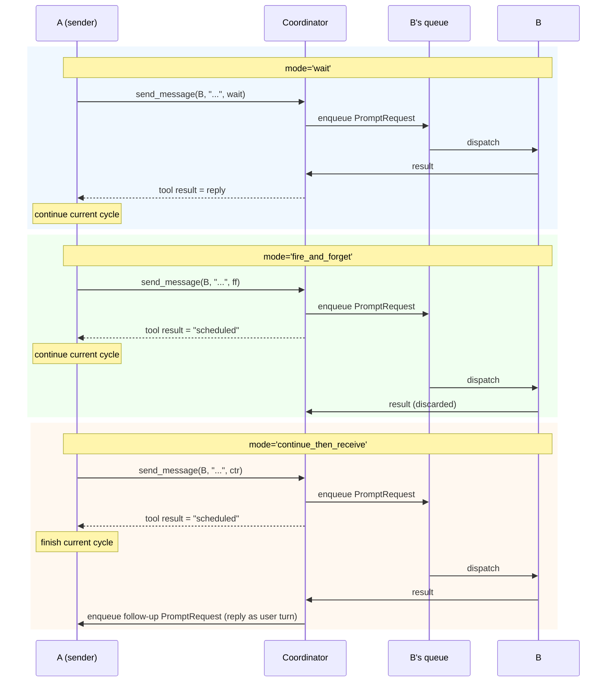
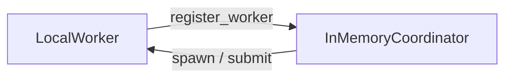
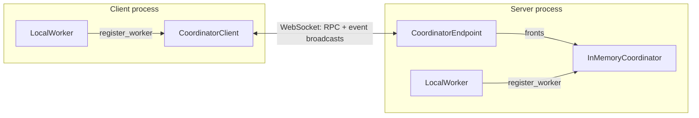

# Strands AI Functions

Strands AI Functions is a Python library for building reliable AI-powered applications through a new abstraction: functions that behave like standard Python functions, but are evaluated by reasoning AI agents.

AI Functions extend the expressivity of standard programming by offering developers a computational model that can solve tasks not easily expressible as traditional code. They can both leverage generative capabilities (e.g., writing summaries or retrieving information) and dynamically generate and execute code to process inputs and return native Python objects. For example, an AI Function can load a user-uploaded file in an arbitrary format and convert it to a normalized `DataFrame` for use in the rest of the workflow.

Direct integration of AI agents in standard workflows is often avoided due to their non-deterministic nature and lack of assurance that instructions will be followed, which can cause cascading errors throughout the workflow. AI Functions address this through extensive use of *post-conditions*. Unlike traditional prompt-based approaches, which try to ensure correctness by relying on prompt engineering alone, AI Functions enforce correctness through runtime post-condition checking: users specify explicit conditions that the output of any given step needs to satisfy, and the library automatically initiates self-correcting loops to ensure these properties hold, avoiding cascading errors in complex workflows.

Because AI Functions *are* functions, developers can construct agentic workflows and agent graphs (including parallel and asynchronous ones) by writing and composing functions, and can build shareable libraries of robust, reusable agentic flows exactly the way they build software libraries today. When a workflow needs more than one-shot calls, the same functions scale up: they can be spawned as stateful **AI Threads** that keep their conversation history, form teams that message each other, run distributed across processes and machines, and even improve over time through natural-language **memory optimization**. This tutorial follows that progression, from a single function call to a distributed team of agents.

## Contents

- [Getting started](#getting-started)
- [AI Functions basics](#ai-functions-basics)
- [Post-conditions](#post-conditions)
- [Python integration](#python-integration)
- [Providing instructions](#providing-instructions)
- [Configuration](#configuration)
- [Parallel workflows](#parallel-workflows)
- [AI Threads: adding state](#ai-threads-adding-state)
- [Teams of agents: the coordinator and workers](#teams-of-agents-the-coordinator-and-workers)
- [Events and observability](#events-and-observability)
- [Memory and optimization](#memory-and-optimization)
- [Distributed operation](#distributed-operation)
- [Running agents across processes](#running-agents-across-processes)
- [Going further](#going-further)

## Getting started

The minimum supported Python version is 3.12. We recommend Python >= 3.14 for native [t-string](https://peps.python.org/pep-0750/) template literal support (used in [Providing instructions](#providing-instructions)), and `uv` (see [installation instructions](https://docs.astral.sh/uv/getting-started/installation/)) to run the provided examples.

To install AI Functions:

```bash
# using pip
pip install strands-ai-functions
# using uv
uv add strands-ai-functions
```

This repo provides several examples. To run them, first configure the credentials for one of the supported model providers (see [Configuring Credentials](https://strandsagents.com/latest/documentation/docs/user-guide/quickstart/python/#configuring-credentials)). Then clone the repo and run the examples using `uv` from within their folder:

```bash
# clone the repo
git clone https://github.com/strands-labs/ai-functions.git
cd ai-functions/examples
# recommended: set env variable to enable rich tool visualization in the terminal
export STRANDS_TOOL_CONSOLE_MODE="enabled"
# run the examples using uv
# (change the model settings inside the example if not using Bedrock as the model provider)
uv run [name_of_the_example].py
```

AI Functions uses the same default model provider as Strands (Amazon Bedrock). You can change the model provider by changing the `model` argument (see [Model Providers](https://strandsagents.com/latest/documentation/docs/user-guide/concepts/model-providers/)):

```python
from ai_functions import ai_function
from strands.models.bedrock import BedrockModel
from strands.models.openai import OpenAIModel

# Use Bedrock
model = BedrockModel(
    model_id="anthropic.claude-sonnet-4-20250514-v1:0"
)
# Alternatively, use OpenAI by just switching model provider
model = OpenAIModel(
    client_args={"api_key": "<KEY>"},
    model_id="gpt-4o"
)

@ai_function(model=model)
def my_function() -> str:
    """[...]"""
```

## AI Functions basics

An AI Function behaves like a standard function, but its code is written in natural language rather than Python, and it is executed by an LLM rather than a CPU. To define one, we use the `@ai_function` decorator, declare the return type with an ordinary return annotation, and describe what the function should do inside its docstring (we will cover alternative methods later):

```python
from ai_functions import ai_function

@ai_function
def translate_text(text: str, lang: str) -> str:
    """
    Translate the text below to the following language: {lang}.
    ---
    {text}
    """

text = "It was the best of times, it was the worst of times"
for lang in ["fr", "ja", "it", "zh"]:
    print(translate_text.run_sync(text, lang=lang))
```

When an AI Function is called, the library automatically creates an agent, generates a prompt from the docstring template and the provided arguments, runs the agent, then parses and validates the result before returning it. From the outside, it behaves like any other Python function.

### Sync and async

AI Functions are async-native: the canonical way to invoke one is to `await` it, which is what allows them to run in parallel and to compose into the multi-agent workflows shown later in this tutorial.

```python
result = await translate_text(text, lang="fr")
```

For plain scripts and quick experiments, every AI Function also provides `run_sync`, which blocks until the result is available:

```python
result = translate_text.run_sync(text, lang="fr")
```

Use whichever fits the context: `run_sync` at the top level of simple scripts, `await` inside async code (and in Jupyter notebooks, where top-level `await` is supported out of the box). The early examples in this tutorial use `run_sync` for brevity; starting from [Parallel workflows](#parallel-workflows), where concurrency is the point, they switch to `await`.

### Return types

AI Functions can return arbitrary data types, including primitive types (`str`, `int`, `float`), Pydantic models, and even native Python objects (see [Python integration](#python-integration)). The library takes care of the necessary conversions and validation under the hood: Pydantic models are passed to the agent as a JSON schema and parsed back on return; primitive types are requested through a synthetic wrapper so the agent still answers via structured output.

The output type is declared with an ordinary return annotation, as in the examples so far. It can also be declared in brackets on the decorator instead:

```python
@ai_function[MeetingSummary]
def summarize_meeting(transcripts: str):
    """
    Write a summary of the following meeting in less than 50 words.
    <transcripts>
    {transcripts}
    </transcripts>
    """
```

The two forms are equivalent. When a type is given in brackets it is always used, regardless of any return annotation; a bare `@ai_function` requires a return annotation to infer the output type from, and raises `TypeError` if none is present.

The annotation form reads like plain Python and is the one used throughout this tutorial and the examples. The bracket form exists for strict type checking: to a type checker, a return annotation describes what the function *body* returns, and the body of a docstring-prompt function returns nothing, so mypy reports errors like "Missing return statement" on `-> MeetingSummary`. Declaring the type in brackets keeps the annotation free for the body's actual return value, which also matters when the body returns the prompt itself (see [Providing instructions](#providing-instructions)). If your codebase runs a strict type checker, migrate to the bracket form; otherwise the annotation form is the natural default.

The following example builds a simple meeting-summarization workflow using structured output:

```python
from pydantic import BaseModel

from ai_functions import ai_function


class MeetingSummary(BaseModel):
    attendees: list[str]
    summary: str
    action_items: list[str]


@ai_function
def summarize_meeting(transcripts: str) -> MeetingSummary:
    """
    Write a summary of the following meeting in less than 50 words.
    <transcripts>
    {transcripts}
    </transcripts>
    """


if __name__ == "__main__":
    transcripts = "[add your meeting transcripts here]"
    meeting_summary = summarize_meeting.run_sync(transcripts)

    print("=== Meeting Summary ===")
    print("Attendees: " + ", ".join(meeting_summary.attendees))
    print("Summary:\n" + meeting_summary.summary)
    print("Action Items:")
    for action_item in meeting_summary.action_items:
        print(action_item)
```

## Post-conditions

A core notion of AI Functions is that programmers should not "prompt-and-pray" for the result returned by the agent to be correct. Rather, they should *verify* that the result satisfies the conditions required by their pipeline.

To this end, AI Functions expose *post-conditions* as a fundamental component. Post-conditions are functions (standard Python functions or other AI Functions) that validate the result and provide feedback to the agent. This automatically instantiates a self-correcting feedback loop ensuring the correctness of the final return value.

The following example extends the meeting summary above with user-defined post-conditions:

```python
from pydantic import BaseModel

from ai_functions import ai_function
from ai_functions.ai_thread import PostConditionResult


class MeetingSummary(BaseModel):
    attendees: list[str]
    summary: str
    action_items: list[str]


# Post-conditions can be standard Python functions that raise an error if validation fails
def check_length(response: MeetingSummary):
    length = len(response.summary.split())
    assert length <= 50, f"Summary should be less than 50 words, but is {length} words long"


# Equivalently, the function can return a PostConditionResult object
def check_length(response: MeetingSummary) -> PostConditionResult:
    length = len(response.summary.split())
    if length > 50:
        return PostConditionResult(passed=False, message=f"Summary should be less than 50 words, but is {length} words long")
    return PostConditionResult(passed=True)


# A post-condition can also be an AI Function, since AI Functions *are* just functions
@ai_function
def check_style(response: MeetingSummary) -> PostConditionResult:
    """
    Check if the summary below satisfies the following criteria:
    - It must use bullet points
    - It must provide the reader with the necessary context
    <summary>
    {response.summary}
    </summary>
    """


# Now we add the functions above as post-conditions validating the model output
@ai_function(post_conditions=[check_length, check_style])
def summarize_meeting(transcripts: str) -> MeetingSummary:
    """
    Write a summary of the following meeting in less than 50 words.
    <transcripts>
    {transcripts}
    </transcripts>
    """
```

All post-conditions are checked in parallel. The agent receives a single message reporting all errors and can address all of them at the same time, reducing the number of iterations necessary to converge to a correct output. The number of retries is bounded by `max_attempts` on the decorator (default 10).

Post-conditions are not limited to checking the answer of the agent. They can more generally enforce invariants about the state of the system after the agent's execution, and they can consume one of the original input arguments by naming it in their signature. The example below implements a coding agent that verifies the correctness of its implementation before moving on to new tasks:

```python
import io
from contextlib import redirect_stderr, redirect_stdout
from typing import Any, Literal

import pytest
from pydantic import BaseModel

from ai_functions import ai_function


class FeatureRequest(BaseModel):
    description: str
    test_files: list[str]


# A post-condition can request one of the original input arguments (e.g., `feature`)
# by adding it to the function signature. In this case, we ignore the actual response
# of the agent (`_answer`) and validate by running the feature's tests.
def run_tests(_answer: Any, feature: FeatureRequest):
    stdio_capture = io.StringIO()
    with redirect_stdout(stdio_capture), redirect_stderr(stdio_capture):
        retcode = pytest.main(feature.test_files)
    pytest_output = stdio_capture.getvalue()
    if retcode:
        raise RuntimeError(pytest_output)


@ai_function(post_conditions=[run_tests])
def implement_feature(feature: FeatureRequest) -> Literal["done"]:
    """
    Implement the following feature in the current code base:
    <feature>
    {feature.description}
    </feature>

    Once done the code base should pass the following tests: {feature.test_files}
    """


def implement_all_features(features: list[FeatureRequest]):
    for feature in features:
        implement_feature.run_sync(feature)
```

Note that we are telling the agent what tests to pass both in the prompt and as a post-condition, which may feel redundant. However, agents are generally much more effective in responding to validation messages than they are at following prompts. Moreover, this provides a strong guarantee to the user: if the pipeline terminates, all required tests are passing, without any need for manual inspection.

## Python integration

AI agents are usually limited to working with serializable input-output types (strings, JSON objects, ...) rather than with native objects of the programming language. AI Functions, on the other hand, aim to provide a natural extension of the programming language itself, enabling new kinds of programming patterns and abstractions. In particular, agents can optionally be provided with a Python environment, allowing them to dynamically generate code to process arbitrary input data and return native Python objects.

Consider, for example, a webapp that allows the user to upload an invoice in an arbitrary format (PDF, CSV, JSON, ...). The following snippet implements a "universal data loader": given the path to a file, the agent inspects its content, decides the appropriate processing pipeline, and returns a `DataFrame` in the desired format, validated by a post-condition. A second AI Function then applies a transformation that cannot be expressed in pure Python. See `examples/code_universal_loader.py` for a complete runnable implementation.

```python
from pandas import DataFrame, api

from ai_functions import ai_function


def check_invoice_dataframe(df: DataFrame):
    """Post-condition: validate DataFrame structure."""
    assert {"product_name", "quantity", "price", "purchase_date"}.issubset(df.columns)
    assert api.types.is_integer_dtype(df["quantity"]), "quantity must be an integer"
    assert api.types.is_float_dtype(df["price"]), "price must be a float"
    assert api.types.is_datetime64_any_dtype(df["purchase_date"]), "purchase_date must be a datetime64"
    assert not df.duplicated(subset=["product_name", "price", "purchase_date"]).any(), \
        "The combination of product_name, price, and purchase_date must be unique"


# code execution has to be explicitly enabled
@ai_function(code_execution_mode="local", code_executor_additional_imports=["pandas.*", "sqlite3", "json"], post_conditions=[check_invoice_dataframe])
def import_invoice(path: str) -> DataFrame:
    """
    The file `{path}` contains purchase logs. Extract them in a DataFrame with columns:
    - product_name (str)
    - quantity (int)
    - price (float)
    - purchase_date (datetime)
    """


@ai_function(code_execution_mode="local", code_executor_additional_imports=["pandas.*"], post_conditions=[check_invoice_dataframe])
def fuzzy_merge_products(invoice: DataFrame) -> DataFrame:
    """
    Find product names that denote different versions of the same product, normalize them
    by removing version suffixes and unifying spelling variants, update the product names
    with the normalized names, and return a DataFrame with the same structure
    (same number of rows and columns).
    """


# Load a JSON (the agent has to inspect the JSON to understand how to map it to a DataFrame)
df = import_invoice.run_sync("data/invoice.json")
print("Invoice total:", df["price"].sum())

# Load a SQLite database (the agent will dynamically check the schema and generate
# the necessary queries to read it and convert it to the desired format)
df = import_invoice.run_sync("data/invoice.sqlite3")
print(df)

# Merge revisions of the same product
df = fuzzy_merge_products.run_sync(df)
```

Currently AI Functions support only `"local"` execution, which creates a local Python environment (similar to a Jupyter notebook) for the agent to use. Execution in a safe remote sandboxed interpreter is a planned extension.

> [!CAUTION]
> The local execution environment attempts to restrict execution to explicitly allowed libraries and methods. However, executing Python code in a non-sandboxed environment is inherently unsafe. Please make sure you understand the risk, and consider running the code inside `docker` or another sandbox.

## Providing instructions

The instructions/prompt of an AI Function can be provided in two ways. The simplest is to specify the prompt as a docstring, as we have done until now:

```python
from ai_functions import ai_function

@ai_function
def translate(text: str, lang: str) -> str:
    """
    Translate the text below to the following language: `{lang}`.
    {text}
    """
```

The AI Function interprets the docstring as a template and replaces the placeholders using the provided arguments. This method however has limitations in some corner cases, for example if the docstring references a non-local variable. It also makes it difficult to construct prompts whose structure depends on the inputs.

Alternatively, we can construct the prompt inside the function and return it. The body of the function can then also be used to perform input validation:

```python
from ai_functions import ai_function

@ai_function[str]
def translate(text: str, lang: str):
    assert text, "`text` cannot be empty"
    assert lang, "`lang` cannot be empty"

    return t"""
    Translate the text below to the following language: `{lang}`.
    {text}
    """
```

Note the bracket form of the decorator: here the body really does return something (the prompt, a `Template`), so a `-> str` output annotation would misdescribe it to a type checker. Declaring the output type in brackets (see [Return types](#return-types)) keeps the annotation available for the body's actual return value.

The preferred way is to return a `Template` (t-string, available since Python >= 3.14) like in the example above. This allows the AI Function to apply custom formatting logic to preserve the correct indentation when replacing multi-line values in the template. On Python 3.12 and 3.13, a standard string can be returned instead, but the user has to take care of ensuring the string has correct indentation, to avoid confusing the agent with improper formatting.

Internally, the AI Function always executes the function body with the provided arguments. If the body returns a string or a `Template`, that value is used as the prompt to the agent. Otherwise, the library falls back to interpreting the docstring as a template.

## Configuration

AI Functions use a Strands Agent in the backend. Any valid option of `strands.Agent` (such as `model`, `tools`, `system_prompt`) can be passed in the decorator:

```python
from typing import Literal

from strands_tools import file_read, file_write

from ai_functions import ai_function


@ai_function(tools=[file_read, file_write])
def summarize_file(path: str, output_path: str) -> Literal["done"]:
    """Read the file {path} and write a summary in {output_path}."""


summarize_file.run_sync("report.md", output_path="summary.md")
```

Alongside the agent options, the decorator also accepts thread-level fields such as `post_conditions`, `max_attempts`, `structured_output`, `thread_name`, `config_hook`, and `summarization_strategy` (see the API reference for the full list).

To simplify maintaining and sharing configuration between different AI Functions, the same settings can be collected into a `ThreadConfig` object and reused:

```python
from ai_functions import ai_function
from ai_functions.ai_thread import ThreadConfig
from strands_tools import http_request as web_search  # any tool will do here


class Configs:
    FAST_MODEL = ThreadConfig(model="global.anthropic.claude-haiku-4-5-20251001-v1:0")
    RESEARCH = ThreadConfig(
        model="global.anthropic.claude-sonnet-4-20250514-v1:0",
        tools=(web_search,),
    )


# reuse a config
@ai_function(config=Configs.RESEARCH)
def research(topic: str) -> str:
    """Research the following topic and return a summary: {topic}"""


# keyword arguments can be used to override config arguments for this specific function
@ai_function(config=Configs.FAST_MODEL, tools=[web_search])
def quick_lookup(topic: str) -> str:
    """Look up the following topic and return a one-line summary: {topic}"""
```

When both `config=...` and explicit kwargs are given, the kwargs merge on top of the config: thread-level fields replace the corresponding field on the config, and the remaining kwargs (such as `system_prompt`, `hooks`, `state`) are forwarded to the underlying `strands.Agent`. This keeps the common case short while allowing arbitrary `strands.Agent` options to pass through unchanged.

A bound AI Function can also be derived without redefining it: `fn.replace(**kwargs)` returns a new `AIFunction` whose config has been updated with the given kwargs. This is useful for building a family of variants (fast vs. thorough, local vs. remote model, different toolsets) without duplicating the prompt function:

```python
fast_research = research.replace(model="global.anthropic.claude-haiku-4-5-20251001-v1:0")
```

Finally, `ThreadConfig.config_hook` is an optional callable invoked at the start of every cycle with the current `ThreadContext`; it returns overrides that are merged into the config for that cycle only. Typical uses are injecting cycle-specific tools or overriding the model based on runtime metadata. When a conversation grows past the model's context window, the history is automatically compacted; the compaction policy is pluggable through `ThreadConfig.summarization_strategy`.

## Parallel workflows

Because AI Functions are async-native, parallel workflows come for free with standard `asyncio` composition. In the example below, we write a report on the current trends of a given stock: first we run two research functions in parallel, then use their results to write the report (see `examples/compose_stock_report.py` for a more complete runnable version).

```python
import asyncio

from pandas import DataFrame
from strands_tools import exa as websearch_tool

from ai_functions import ai_function


@ai_function(tools=[websearch_tool])
def research_news(stock: str) -> str:
    """
    Research and summarize the current news regarding the following stock: {stock}
    """


@ai_function(code_execution_mode="local", code_executor_additional_imports=["yfinance.*", "pandas.*"])
def research_price(stock: str, past_days: int) -> DataFrame:
    """
    Use the `yfinance` Python package to retrieve the historical prices of {stock} in the last {past_days} days.
    Return a dataframe with columns [date, price (float, price at market close)]
    """


@ai_function
def write_report(stock: str, news: str, prices: DataFrame) -> str:
    """
    Write and return a HTML report on the trend of the stock {stock} in the last 30 days.
    Use the provided `prices` DataFrame and the following summary of recent news:
    {news}
    """


async def stock_research_workflow(stock: str) -> str:
    # Run the two agents in parallel
    news, prices = await asyncio.gather(
        research_news(stock),
        research_price(stock, past_days=30),
    )
    # Use their results to write a report
    return await write_report(stock, news, prices)


if __name__ == "__main__":
    print(asyncio.run(stock_research_workflow("AMZN")))
```

Note that nothing agent-specific is happening in `stock_research_workflow`: it is ordinary `asyncio` code, and every pattern that works with coroutines (gather, task groups, timeouts, semaphores for rate limiting) works with AI Functions unchanged.

## AI Threads: adding state

AI Functions are stateless: each call is a one-shot that runs on a fresh thread, and no history is kept between calls. Some use cases need more: a chatbot accumulating turns, an assistant that remembers the context it was given. For these, an AI Function can be `spawn`ed as an **AI Thread**: a live, stateful object that stays alive across several calls.

`spawn()` returns a `ThreadHandle`, a thin reference to a live thread on which every subsequent `run` accumulates history:

```python
import asyncio

from ai_functions import ai_function


@ai_function
def assistant(message: str) -> str:
    """{message}"""


async def main() -> None:
    handle = await assistant.spawn()

    r1 = await handle.run(message="What is the capital of France?")
    print(f"Turn 1: {r1}")

    # The agent sees the full conversation history from turn 1.
    r2 = await handle.run(message="What about Germany?")
    print(f"Turn 2: {r2}")


if __name__ == "__main__":
    asyncio.run(main())
```

The function itself is unchanged from an ordinary AI Function; what is different is that the handle keeps its event log between calls, so the agent sees the full conversation on each subsequent `run`.

`run` enqueues work on the thread's FIFO queue and returns a future that resolves when the cycle completes. Multiple concurrent `run` calls on the same handle do not run in parallel: each call enqueues one unit of work behind any already pending, and the thread consumes them one at a time.

### Forking

A live thread can be forked into a new thread seeded with a copy of its history. The two handles share the past but diverge from the moment of the fork onwards. This is useful to explore alternative branches of a conversation without losing the original:

```python
import asyncio

brief = "Our company is considering acquiring a small competitor."

handle = await assistant.spawn()
await handle.run(message=f"Context: {brief}")

# Fork the conversation into two branches.
optimistic = await handle.fork()
pessimistic = await handle.fork()

positive, negative = await asyncio.gather(
    optimistic.run(message="Give me the positive outlook on this deal."),
    pessimistic.run(message="Give me the negative outlook on this deal."),
)
```

Both forks start from the same context turn, but their histories then evolve independently: `positive` never sees what `pessimistic` asked, and vice versa.

### Injecting messages

In addition to `run`, a handle supports `notify`:

```python
await handle.notify(
    "[system hint] To run git commands, prefer `git -C <path>` over `cd`."
)
```

`run` and `notify` are two independent primitives. `run(*args, **kwargs)` is the default path: it enqueues a unit of work and returns a future for its typed result. `notify(text)` is a best-effort side channel: a text payload is handed to the thread with no guarantee about whether, when, or how it surfaces. In particular, `notify` does **not** start a cycle; an idle thread stays idle until the next `run`. An `AIThread` buffers the text and surfaces it as a system-style hint on its next turn, which is useful for attaching out-of-band context the LLM should consider.

### Lifecycle

A handle exposes the thread's lifecycle as explicit methods. All of them are idempotent and safe to call from multiple tasks:

```python
# Current runtime-maintained status: NOT_STARTED, RUNNING, IDLE,
# PAUSED, CANCELLED, TERMINATED, or FAILED.
status = await handle.status()

# Suspend and resume the in-flight cycle at its next work boundary.
await handle.pause()
await handle.resume()

# Cooperatively cancel the in-flight cycle. The thread remains registered
# and continues to accept new work.
await handle.cancel()

# Schedule graceful termination behind currently-queued work.
await handle.terminate()

# Tear the thread down immediately, cancelling any in-flight cycle and
# dropping queued work.
await handle.terminate_now()
```

## Teams of agents: the coordinator and workers

Calling an AI Function directly, or spawning a single handle with `fn.spawn()`, both rely on a private coordinator and worker created behind the scenes for the duration of the call. As soon as several threads need to coexist (because they run in parallel, talk to each other, or share rate-limit state), these two objects become explicit:

- An **`InMemoryCoordinator`** is the registry and router: it keeps track of which threads and workers exist, stores their event logs, and routes every cross-thread operation.
- A **`LocalWorker`** is the execution engine: it hosts threads and drives their cycles on an asyncio dispatcher task. A worker must register itself with a coordinator before it can host any thread; a coordinator can have several workers registered, including remote ones (see [Distributed operation](#distributed-operation)).

```python
from ai_functions.runtime import InMemoryCoordinator, LocalWorker

coord = InMemoryCoordinator()
worker = await LocalWorker(coord).register()
```

Once a worker is registered, threads are spawned through the coordinator. `coord.spawn(target, *, thread_name=None, parent_id=None, metadata=None, ...)` returns a `ThreadHandle`, exactly like `fn.spawn()`:

```python
handle = await coord.spawn(my_function, thread_name="my_thread")
```

`thread_name` is used for telemetry and for peer discovery; `parent_id` attaches the new thread to a parent for hierarchical token-usage rollup; `metadata` is opaque application data.

The following example runs a small research workflow with one planner, three researchers in parallel, and one synthesizer, all on the same coordinator:

```python
import asyncio

from pydantic import BaseModel

from ai_functions import ai_function
from ai_functions.runtime import InMemoryCoordinator, LocalWorker


class ResearchPlan(BaseModel):
    subtasks: list[str]


@ai_function
def planner(topic: str) -> ResearchPlan:
    """Break down the research topic into 2-3 subtasks: {topic}"""


@ai_function
def researcher(subtask: str) -> str:
    """Research this subtask thoroughly: {subtask}"""


@ai_function
def synthesizer(findings: str) -> str:
    """Synthesize these findings into a summary:\n\n{findings}"""


async def main() -> None:
    coord = InMemoryCoordinator()
    worker = await LocalWorker(coord).register()

    # Spawn and run the planner.
    planner_handle = await coord.spawn(planner, thread_name="planner")
    plan = await planner_handle.run(topic="quantum computing applications")

    # Spawn researchers as children of the planner; token usage rolls up.
    researcher_handles = [
        await coord.spawn(
            researcher,
            thread_name=f"researcher-{i}",
            parent_id=planner_handle.id,
        )
        for i in range(len(plan.subtasks))
    ]

    # Run all researchers in parallel.
    findings = await asyncio.gather(*[
        h.run(subtask=task)
        for h, task in zip(researcher_handles, plan.subtasks, strict=True)
    ])

    # Synthesize.
    synth_handle = await coord.spawn(synthesizer, thread_name="synthesizer")
    summary = await synth_handle.run(findings="\n\n".join(findings))
    print(summary)

    await worker.close()
```

`worker.close()` gracefully terminates every thread the worker hosts and deregisters the worker from the coordinator.

In this example, all routing decisions were made by our Python code. But threads on the same coordinator can also find each other and communicate *on their own*, which is what turns a set of threads into a team.

### Cross-thread messaging

Every `AIThread` is given two extra tools by default:

- `list_threads()` returns a snapshot of every thread registered with the coordinator, including an `is_self` flag marking the calling thread.
- `send_message(thread_id, message, mode="wait")` routes a message to a peer through the coordinator. The message is enqueued on the peer's work queue: if the peer is currently busy, the message waits behind any pending work.

This is all it takes to build a two-agent team: a `researcher` that can search the web, and a `writer` that delegates fact-finding to it:

```python
import asyncio

from strands_tools import exa

from ai_functions import ai_function
from ai_functions.runtime import InMemoryCoordinator, LocalWorker


# `researcher` knows how to look things up on the web.
@ai_function(tools=[exa])
def researcher(topic: str) -> str:
    """
    Research the following topic on the web and return a concise factual
    summary, citing the sources you used:

    {topic}
    """


# `writer` is a short-form writer. The prompt tells it about its teammate;
# the `send_message` tool is injected automatically by the coordinator and
# lets it ask the researcher follow-up questions.
@ai_function
def writer(brief: str) -> str:
    """
    Write a short report based on the following brief: {brief}

    Work with a teammate named `researcher` (who has access to web search).
    Send them messages on what to search, or follow-up messages to request
    missing information.
    """


async def main() -> None:
    coord = InMemoryCoordinator()
    worker = await LocalWorker(coord).register()

    # Spawn one thread of each kind, on the same coordinator.
    _ = await coord.spawn(researcher, thread_name="researcher")
    writer_handle = await coord.spawn(writer, thread_name="writer")

    # Kick off the writer. It will reach out to the researcher on its own,
    # via the `send_message` tool, whenever it needs a fact.
    report = await writer_handle.run(
        brief="recent progress on room-temperature superconductors",
    )
    print(report)


if __name__ == "__main__":
    asyncio.run(main())
```

`send_message` supports three modes:

- `"wait"` (default): await the peer's cycle and return its reply as the tool's result. This blocks the sender's current cycle on the peer's cycle.
- `"fire_and_forget"`: schedule the peer's cycle as a background task and return immediately. The peer's reply is discarded.
- `"continue_then_receive"`: schedule the peer's cycle, return immediately, and when the peer completes, enqueue a fresh cycle on the sender with the peer's reply formatted as the user turn. This is the "dispatch-and-resume" pattern: the sender's current cycle ends promptly, and a follow-up cycle is kicked off automatically when the reply arrives.



Application code has an equivalent, code-facing side channel: `handle.notify(text)`, described in [AI Threads](#ai-threads-adding-state), routes out-of-band context to any registered thread without starting a cycle.

For a complete runnable example exercising all three `send_message` modes, see `examples/team_two_workers_local.py`.

## Events and observability

Every cross-thread operation goes through the coordinator as an event. Thread lifecycle transitions, user and assistant turns, tool calls, token usage, and cycle results are all emitted as `Event` objects, durably stored in the coordinator's log, and fanned out to any subscriber.

`coordinator.on(callback, *, thread_id=None, kinds=None)` registers a live subscriber for future events. The returned `Subscription` is also usable as a context manager:

```python
from ai_functions.types import CompletedEvent, Event, FailedEvent, StartedEvent


def log_event(event: Event) -> None:
    match event:
        case StartedEvent(thread_name=name):
            print(f"  ▶ {name or 'thread'} started")
        case CompletedEvent(thread_name=name):
            print(f"  ✓ {name or 'thread'} completed")
        case FailedEvent(thread_name=name, error=error):
            print(f"  ✗ {name or 'thread'}: {error}")
        case _:
            pass


# Subscribe for the lifetime of the program.
coord.on(log_event)

# Or subscribe only for the duration of a block, restricted to a single thread.
with coord.on(log_event, thread_id=handle.id):
    await handle.run(...)
```

To inspect the stored log after the fact (for replay, for a UI that attaches late, for analysis), `coordinator.get_events(thread_id, ...)` returns the events for a thread in chronological order, with optional filters on `since_id`, `kinds`, and `limit`.

Built-in events cover thread lifecycle (`STARTED`, `COMPLETED`, `FAILED`, `CANCELLED`, `RESULT`), conversation content (`MESSAGE_USER`, `MESSAGE_ASSISTANT_*`), tool activity (`TOOL_CALL`, `TOOL_RESULT`), tool approvals, session management, and token usage (`TOKEN_USAGE`). The full list and the fields carried by each kind are documented in the API reference under `ai_functions.types`.

User code can emit its own event kinds through `CustomEvent`; any `kind` string outside the built-in enum is delivered to subscribers the same way built-in events are, making the event log a single place to aggregate observability data from both library internals and application code:

```python
from ai_functions.types import CustomEvent

coord.append_event(CustomEvent(
    kind="my_app_metric",
    thread_id=handle.id,
    payload={"step": "validation", "duration_ms": 42},
))
```

## Memory and optimization

Just as PyTorch or JAX let you optimize parameters via backpropagation through a computation graph, AI Functions let you optimize agentic workflows via natural-language feedback propagation. You define named parameters (prompt fragments, learned facts, or reusable Python code) in a *memory schema*, store them in a memory backend, and pass them to your functions as ordinary arguments. After a run, you attach feedback to the output; the library traces that feedback back through the graph of agentic calls that produced it and updates each contributing parameter, so the next run recalls the improved values. Feedback also propagates across child threads: if a thread spawns a child during its execution, the feedback reaches the child and the child's memory.

The feedback acts as the gradient and the parameters are the values being optimized, except both are expressed in natural language instead of numbers. *Procedural* parameters apply the same idea to code: the optimizer can store the Python an agent wrote to solve a task, so a later run reuses a working implementation instead of regenerating one from scratch, a form of JIT compilation for agentic logic.

The system has three main pieces:

1. A **memory backend** stores named parameters (strings, lists, or code) and exposes them through `recall` (full value), `search` (top-k matching entries), and `query` (question-answering over the content). Reads return a `ParameterView` (the value plus the metadata that links it into the graph) and are recorded into the consuming thread's event log.
2. A **computation graph** records which parameters and results contributed to a given output. It is reconstructed after a run from the event logs, plus the dataflow edges `trace` discovers in the call arguments.
3. An **optimizer** walks the computation graph backward from the feedback, determines which parameters are responsible and how they need to change, and consolidates the updates into the memory backend.

### Quick example

`trace()` runs a function exactly like a call, but returns a `Result` that remembers its provenance; `optimizer.step` then rebuilds the graph, backpropagates the feedback, and consolidates the updates, with no coordinator or graph wiring:

```python
import asyncio

from pydantic import BaseModel, Field

from ai_functions import JSONMemoryBackend, TextGradOptimizer, ai_function


@ai_function
def write_summary(text: str, tone_guidelines: str) -> str:
    """
    Summarize the following text:
    {text}

    Follow these tone guidelines:
    {tone_guidelines}
    """


# Memory parameters are described with a Pydantic schema: types, defaults, and
# descriptions guide the optimizer in understanding what each parameter means.
class WritingMemory(BaseModel):
    tone_guidelines: str = Field(
        "No specific guidelines yet.",
        description="Guidelines for the tone of the writing",
    )


async def main() -> None:
    # Both backends and optimizers are pluggable: subclass MemoryBackend or
    # TextGradOptimizer to provide your own. The library ships with a file-based
    # JSONMemoryBackend and a TextGrad-inspired optimizer.
    memory = JSONMemoryBackend(WritingMemory, actor_id="user-1", path="memory.json")
    optimizer = TextGradOptimizer()

    # trace() runs the function and records which recalled parameters it
    # consumed; passing the ParameterView as an argument wires the edge.
    summary = await write_summary.trace(
        text="some long document...",
        tone_guidelines=await memory.recall("tone_guidelines"),
    )
    print(summary)

    # Rebuild the graph, propagate the feedback backward, and consolidate the
    # updates into memory. On the next run, the improved value is recalled.
    await optimizer.step(
        summary,
        "The summary should be more concise and use bullet points.",
        backends=[memory],
    )
    print(memory)

    # Close the memory to flush the new values and release resources.
    memory.close()


if __name__ == "__main__":
    asyncio.run(main())
```

See `examples/memory_optimization.py` for a full memory-optimization workflow on a multi-agent graph.

For a worked end-to-end learning loop on DS-1000 code-generation problems, see `examples/memory_backprop_scipy.py`. It runs a three-step ablation: direct test with empty memory, train on 8 problems in parallel (gradients accumulated via `optimizer.backward`), then re-test with the trained memory. The shared `examples/_ds1000_utils.py` wraps the DS-1000 executor so execution failures flow into the optimizer feedback as rich context.

### Memory backends

A memory backend manages the storage, retrieval, and consolidation of parameters. The `MemoryBackend` base class handles all graph wiring: subclass it and implement the storage methods to build your own. The library ships with two implementations: `JSONMemoryBackend` (file-based) and `AgentCoreMemoryBackend` (backed by Amazon Bedrock AgentCore memory).

Every backend manages a set of named parameters whose types, defaults, and metadata are defined through a Pydantic schema:

```python
from pydantic import BaseModel, Field

from ai_functions.memory import Frozen, Procedural


class MemorySchema(BaseModel):
    # A regular string parameter, optimizable by default.
    user_preferences: str = Field(
        "No preferences known.",
        description="Known facts and preferences about the user",
    )

    # A list parameter: each entry is a separate piece of knowledge.
    learned_rules: list[str] = Field(
        default_factory=list,
        description="Rules learned from past interactions",
    )

    # A procedural parameter: stores reusable Python code.
    helper_functions: Procedural

    # A frozen parameter: recalled but not updated by the optimizer.
    system_prompt: Frozen[str] = Field(
        "You are a helpful assistant.",
        description="Base system prompt (not optimized)",
    )
```

The `description` on each field guides the optimizer in understanding what kind of content belongs in that parameter. `Procedural` parameters store Python functions that are loaded into the agent's code-execution environment; the optimizer can generate and refine that code from feedback. `Frozen` parameters are skipped during optimization (useful when the backend is used only for storage).

Parameters can be retrieved in three ways. Each method is `async` and returns a `ParameterView` — an opaque wrapper carrying the value plus the metadata (name, backend, derivation) that links it into the computation graph:

```python
# Full recall: the entire parameter value.
guidelines = await memory.recall("tone_guidelines")

# Query: asks the backend to answer a question given the parameter content.
answer = await memory.query("learned_rules", query="What do we know about date formatting?")

# Search: the top-k matching entries (for list parameters).
matches = await memory.search("learned_rules", query="formatting", k=3)
```

A view interpolates into f-strings and prompts like the plain value (`str(view)` is `str(view.value)`), and the runtime unwraps it automatically when it is passed to a function; use `.value` for the raw value. Passing the view itself as an argument (rather than an f-string of it) is what preserves the graph edge. Inside a running thread (e.g. a memory tool call), the read is recorded into that thread's event log immediately; outside one, `trace()` records it when the view is consumed.

Each read also carries *derivation metadata* (`view.meta`, recorded into the recall event): the query, and, for `search` on the JSON backend, the stable `entry_id` of every returned entry. The optimizer feeds that context back into `consolidate`, so feedback on a run that searched a list updates exactly the entries the run retrieved: the JSON backend consolidates lists with an agentic memory manager that adds, updates, and deletes entries by id instead of rewriting the whole list.

Declare the receiving parameter as the plain type it actually uses: the runtime unwraps every handle to its `.value` before the function body runs, so the body only ever sees the plain value. `trace()` accepts the handles regardless (its signature is `*args`/`**kwargs`), so no special annotation is needed to keep handle-passing type-checked:

```python
@ai_function
def write_summary(text: str, tone_guidelines: str) -> str:
    """Summarize {text} following {tone_guidelines}."""

# A recalled parameter (a handle) can be passed straight to trace():
await write_summary.trace(text=doc, tone_guidelines=await memory.recall("tone"))
```

### Reconstructing the computation graph

To propagate feedback back to parameters, the optimizer needs to know which parameters and function calls contributed to a given output. Most of that information lives in the event logs (every parameter read, every spawned child); the missing part — one function's output passed into another in plain Python — is discovered by `trace()`, which scans its arguments for `ParameterView` / `Result` handles:

```python
research = await researcher.trace(topic=topic, sources=await memory.recall("sources"))
report = await report_writer.trace(research=research, style=await memory.recall("style"))

# step() rebuilds the graph from the report's provenance (research becomes a
# child node), walks it backward, and determines whether the issue originated
# in the research or report-writing step before updating the parameters.
await optimizer.step(report, "The report lacks specific citations.", backends=[memory])
```

For inspection, or when you manage threads by hand, the lower-level pieces remain available: `build_graph_from_result(result, backends)` returns the same graph `step` uses, and `build_graph(coord, thread_id, backends)` reconstructs one thread (recursing into children it spawned) from an explicit coordinator, with sibling edges wired by hand.

### The optimizer

Optimizers are pluggable: custom ones implement `backward` (propagate feedback through the graph) and `consolidate` (apply the accumulated feedback to memory). The shipped `TextGradOptimizer` takes a local approach loosely inspired by [TextGrad](https://arxiv.org/abs/2406.07496): it walks the graph backward node by node, using an LLM to distribute feedback from each result to its inputs until it reaches the leaf parameters. A global optimizer that reflects on the entire trace at once can be defined in the same way.

```python
optimizer = TextGradOptimizer(model="global.anthropic.claude-haiku-4-5-20251001-v1:0")

# One call: rebuild the graph from a traced result, backward, consolidate.
graph = await optimizer.step(result, "The output should include more detail.", backends=[memory])

# Or step by step, over a graph you built yourself:
# 1. Backward: propagate feedback through the graph.
optimizer.backward(node, "The output should include more detail.")

# 2. Consolidate: apply accumulated feedback to each parameter's backend.
optimizer.consolidate(node)

# 3. (Optional) Zero grad: clear feedback for the next iteration.
optimizer.zero_grad(node)
```

The steps are also exposed separately so you can inspect the propagated feedback before committing it, or accumulate feedback from multiple runs before consolidating. `backward` and `consolidate` operate on the same graph object: gradients accumulate on nodes built once, which is why `step` returns the graph it built.

### Memory as a tool provider

A memory backend can expose its parameters as tools that an agent calls dynamically during execution, letting the agent decide when and what to retrieve:

```python
from pydantic import BaseModel, Field

from ai_functions import ai_function
from ai_functions.memory import JSONMemoryBackend


class TravelMemory(BaseModel):
    preferences: str = Field(
        default="Prefers warm destinations. Likes hiking and local food.",
        description="Travel preferences and style of the user",
    )
    visited: list[str] = Field(
        default=[
            "Tokyo, Japan - loved the street food and temples",
            "Barcelona, Spain - enjoyed the architecture and beaches",
        ],
        description="Places the user has visited with brief notes",
    )


memory = JSONMemoryBackend(TravelMemory, "traveler-1", path="travel.json")
tools = memory.tool_provider("preferences", "visited")


@ai_function(tools=[tools])
def travel_assistant(request: str) -> str:
    """You are a travel planning assistant with access to the user's travel memory.
    Use the available tools to look up their preferences and past trips.

    User request: {request}
    """
```

`tool_provider` generates schema-scoped tools (`recall_<name>`, `query_<name>`, `search_<name>` for lists, and `save_<name>` / `delete_<name>` for scalars). You can restrict which operations are available: for example, `memory.tool_provider(..., operations={"recall", "search", "query"})` provides read-only access. See `examples/memory_tools.py` for a complete example.

## Distributed operation

Everything so far assumed a single process: one coordinator and one or more workers in the same Python interpreter. Deployments often need to split these across machines: an AI platform running in the cloud, a client connecting to it from a developer laptop, a fleet of workers serving a shared pool of jobs.

To do this, the in-process `InMemoryCoordinator` is replaced with a `CoordinatorClient` connected to a remote `CoordinatorEndpoint`. **The rest of the API is unchanged**: `spawn`, `run`, `send_message`, and event subscriptions behave identically whether the coordinator is local or remote.

The example below stands up an endpoint and connects two clients to it, each hosting one worker and one thread. Everything runs in a single process here, but every call still crosses the loopback WebSocket, so it exercises the same path a real deployment would use:

```python
import asyncio

from ai_functions import ai_function
from ai_functions.network import CoordinatorClient, CoordinatorEndpoint
from ai_functions.runtime import LocalWorker


@ai_function(structured_output=False)
def chat(message: str) -> str:
    """{message}"""


async def main() -> None:
    # The endpoint fronts an InMemoryCoordinator over a WebSocket.
    endpoint = CoordinatorEndpoint()
    await endpoint.start(host="127.0.0.1", port=9901)

    # Two clients, each hosting one worker.
    client_a = await CoordinatorClient.connect(endpoint.url)
    worker_a = await LocalWorker(client_a, worker_id="worker-A").register()

    client_b = await CoordinatorClient.connect(endpoint.url)
    worker_b = await LocalWorker(client_b, worker_id="worker-B").register()

    # Spawn one thread on each worker. Both threads are visible from either
    # client and from the endpoint, even though in a real deployment they
    # would live in different processes.
    alice = await client_a.spawn(chat, thread_name="alice")
    bob = await client_b.spawn(chat, thread_name="bob")

    relayed = await alice.run(
        "Use send_message to ask bob 'What is the capital of Japan?' "
        "with mode='wait'. Then report bob's reply verbatim.",
    )
    print(f"alice: {relayed.strip()}")

    await worker_a.close()
    await worker_b.close()
    await client_a.close()
    await client_b.close()
    await endpoint.stop()
```

The only difference from the in-process version is the coordinator: `CoordinatorClient.connect(url)` in place of `InMemoryCoordinator()`. `alice` reaches `bob` through the same `send_message` tool it would use in a shared process, even though in a real deployment the two threads would run on different machines.

**In-process deployment**



**Distributed deployment**



Note that a worker runs in the same process as the threads it hosts, and this is sometimes a requirement rather than a convenience: a thread may close over a database connection, a file handle, or an in-memory model that only exists on the caller's machine. The client-side worker lets such a thread run where its resources are while remaining reachable — as a full peer — through the shared coordinator. For details on how spawn targets are serialized across the wire (and how to avoid serialization entirely with `LocalWorker.spawn_locally`), see the [architecture documentation](architecture.md).

## Running agents across processes

The `ai-functions` command-line tool and `ai_functions.serve` together let a user assemble a toolkit — or a team — of agents, each defined in its own script. A single machine-wide coordinator runs in the background; every agent script, started independently, connects to that coordinator on startup, registers itself, and becomes discoverable by every other agent.

Start the coordinator once:

```bash
$ ai-functions server
ai-functions coordinator listening at ws://127.0.0.1:52115/rpc
runtime file: …/ai_functions/coordinator.json
```

Write each agent as a standalone script. `ai_functions.serve` registers the spawnable with the running coordinator and keeps the process alive until interrupted:

```python
# alice.py
import ai_functions
from ai_functions import ai_function


@ai_function(structured_output=False)
def alice(message: str) -> str:
    """You are Alice. Bob knows geography; ask him when appropriate. {message}"""


if __name__ == "__main__":
    ai_functions.serve(alice, thread_name="alice")
```

```python
# bob.py
import ai_functions
from ai_functions import ai_function


@ai_function(structured_output=False)
def bob(message: str) -> str:
    """You are Bob. Answer geography questions concisely. {message}"""


if __name__ == "__main__":
    ai_functions.serve(bob, thread_name="bob")
```

Launch each script in its own terminal:

```bash
$ python alice.py
$ python bob.py
```

Alice and Bob are now hosted in separate processes, both registered with the same coordinator. Alice's `send_message` tool can locate Bob via `list_threads` and route a message to him; Bob's reply flows back through the same coordinator.

A script that does not call `serve` itself can still be hosted directly from the command line: `ai-functions run` loads a script, finds its `main` spawnable, hosts it on the running coordinator, and prints the new thread id and how to drive it:

```bash
$ ai-functions run alice.py
hosting 'main' as thread-a3f2…
  submit:  ai-functions submit thread-a3f2… "<prompt>"
  attach:  ai-functions attach thread-a3f2…
  (Ctrl-C to stop)
```

With agents running, the `ai-functions` CLI drives them from the terminal:

```bash
$ ai-functions ps
THREAD ID                STATUS       SHAPE        NAME                 WORKER
thread-a3f2…             idle         str_prompt   alice                worker-91b4…
thread-77c1…             idle         str_prompt   bob                  worker-c802…

$ ai-functions submit thread-a3f2 "pick a city"
How about Kyoto?

$ ai-functions submit thread-a3f2 "pick a city" --json   # result + token usage + timing
$ ai-functions notify thread-a3f2 "remember: stay in Asia"  # side-channel, no cycle

$ ai-functions logs thread-a3f2 --follow
  ▷ user: pick a city
  ◁ assistant: How about Kyoto?
  Σ tokens: in=142 out=14 (total=156)

$ ai-functions attach thread-a3f2      # open a live TUI for this thread
$ ai-functions kill thread-a3f2        # graceful terminate
$ ai-functions kill thread-77c1 --now  # hard stop
```

`submit` starts one cycle with the given prompt and blocks until it resolves; `--json` enriches the output with token usage and timing. `notify` is the side channel from [AI Threads](#ai-threads-adding-state): it hands the thread a message without starting a cycle. `attach` opens a TUI with two views, a clean conversation view and a raw event view, so a long log stays readable.

## Going further

This tutorial covered the user-facing surface of the library. Two more advanced topics are documented separately:

- **Custom spawnables**: every thread in the library implements two small protocols, `Spawnable` (a factory producing a live thread) and `Thread` (the runtime surface the worker drives). `AIFunction` is the built-in implementation, but any class satisfying the protocols can be hosted by a worker. In particular, a custom spawnable can be a **plain-Python workflow that runs as a thread**: its `execute` contains no LLM call at all, but uses `ctx.coordinator` to spawn AI subagents, run them (in parallel with `asyncio.gather`, sequentially, or in any control flow Python can express), and return a typed result. Because the workflow is itself a thread, it gets everything threads get for free: a handle, lifecycle control, an event log, hierarchical token rollup from its children via `parent_id`, and reachability as a peer through `send_message`. This is the way to define orchestration logic that is not well expressed as a single prompt, or that needs access to unserialized local state. See the [architecture documentation](architecture.md#custom-spawnables) for the protocol details and a worked report-writing workflow.
- **Under the hood**: a guided walk through the library's internals, tracing a local `run`, a remote `run`, a cross-worker `send_message`, and an event fan-out end to end. See the [architecture documentation](architecture.md#under-the-hood).

The complete API surface is documented in the [API reference](https://strandsagents.com/latest/documentation/).
