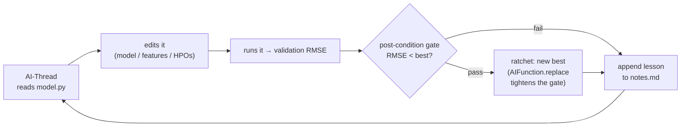

# Looped-Threads — house-price prediction

A **Looped-Thread**: an AI-Thread that runs a *modify → run → keep/discard →
repeat* loop, continuously editing and re-running one script to search for the
best model on the Kaggle
[House Prices](https://www.kaggle.com/competitions/house-prices-advanced-regression-techniques)
(Ames Housing) dataset. It explores model families, selects one, and refines its
preprocessing and hyperparameters — while a locked, code-measured gate on a
held-out validation split makes overfitting impossible to cheat past.

The seed is a one-line **linear baseline**; the thread grows a `MODELS` catalog
with richer families — regularized linear models, tree ensembles, a small neural
net, stacked ensembles — keeping every model it tries in its best configuration
and pointing `MODEL_NAME` at the current winner. The held-out gate keeps only the
edits that genuinely generalize better, so by the end `model.py` is a side-by-side
catalog of tuned models with the best one selected.

## How it works



Each round the thread **reads** `model.py`, **edits** the tunable block, **runs**
it to compute the validation RMSE, and the **post-condition** re-runs it as a
locked check: if the RMSE beats the current best, the ratchet installs a tighter
gate (`AIFunction.replace`) for the next round. Either way the thread **appends**
what it learned to `notes.md`, which it re-reads at the start of every round.

## Files

| File | Role |
|---|---|
| `main.py` | The orchestration loop — the ratchet, the locked evaluator (post-condition), and the thread's file tools (`read_file` / `write_file` / `run_python`). |
| `seed_model.py` | The model script the thread edits. A `MODELS` catalog seeded with a linear baseline, plus fixed, un-editable data/split/metric scaffolding; the thread only grows the catalog in the block marked "EDIT THIS" and sets `MODEL_NAME`. |
| `plotting.py` | Draws the learning-curve figure from `experiments.csv`. |
| `pyproject.toml` | This example's own dependencies (scikit-learn, matplotlib, …). |

## Run

This example carries its own dependencies, so run it from its folder:

```bash
cd examples/looped-threads
uv run main.py
```

Requires credentials for a supported model provider (defaults to Amazon Bedrock).
The dataset is fetched once via scikit-learn's `fetch_openml('house_prices')` and
cached locally, so the thread's many re-runs are fast and offline.

**Dependencies** are declared in this folder's own `pyproject.toml`
(`scikit-learn`, `matplotlib`, `pandas`, plus the base `strands-ai-functions`),
so this example's requirements are self-contained.

## Output (generated locally, gitignored)

- A learning-curve figure, `house_prices_search.png`, showing the best validation
  RMSE stepping down as the search improves, each step annotated with the model
  and hyperparameters that produced it.
- A `.lab/` directory (beside this README) holding the run's state — `model.py`
  (the thread's edits — the accumulated `MODELS` catalog), `notes.md` (the lab
  notebook), and `experiments.csv`.

`_seed_lab()` in `main.py` **automatically wipes and re-seeds `.lab/` at the start
of every run**, so each run starts fresh from the seed — no manual cleanup needed.
